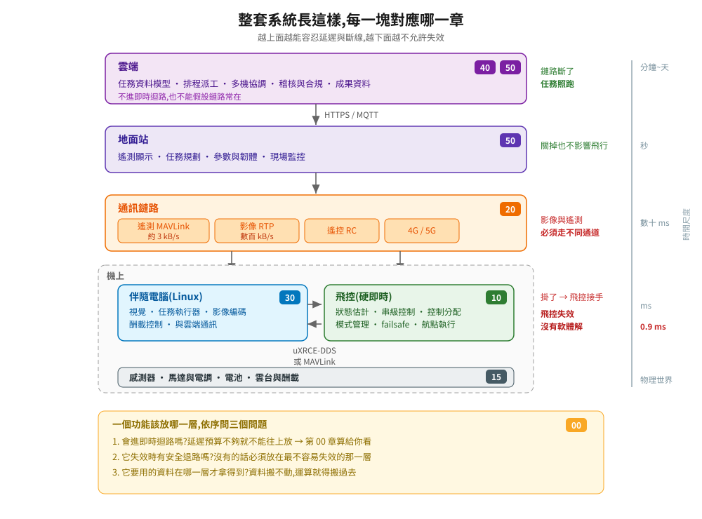
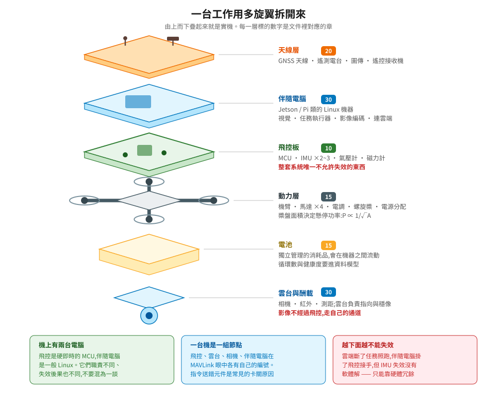

# 無人機系統專論 — 寫給軟體工程師

無人機系統看起來像機器人,骨子裡是一組**約束特別嚴苛的分散式系統**:其中一個節點是硬即時的,控制迴圈慢個二十毫秒就會摔機;節點之間的鏈路會斷,而且頻寬常常只有數十 kbps;所有操作都不可回滾——飛機已經飛出去了,沒有 rollback 這種東西。

寫過後端的人其實有八成技能可以直接搬過來:狀態機、冪等、重試與退避、事件溯源、契約測試、CI。真正要補的是另外兩成:**哪些事情不能進即時迴路、為什麼協定長成這樣、失效的時候預設要往哪裡退。** 這份專論寫的就是那兩成。

每一章都從「這裡要解決什麼根本問題」開始推。看到一個奇怪的設計(8-bit 的系統編號、z 軸朝下的座標系、切模式前要先送一陣子指令),先問它當初擋住了什麼,再談要不要換掉。

---

## 先看這兩張圖

整套系統的樣子,以及每一塊由哪一章負責:

<p align="center">
  
</p>

機上那台機器拆開來長這樣:

<p align="center">
  
</p>

---

## 從哪裡開始讀

看你現在要做什麼,不必從頭讀到尾:

| 你的處境 | 建議路線 |
|---|---|
| 想先知道這領域有哪些現成東西可用,不想重造輪子 | [05 開源生態](docs/05-open-source-landscape/) → [00 系統全景](docs/00-system-overview/) |
| 接到 GCS 或後端專案,要設計任務服務 | [00 系統全景](docs/00-system-overview/) → [15 機體與包絡](docs/15-airframes-and-envelope/) → [40 任務控制](docs/40-mission-control/) → [50 地面站與雲端](docs/50-gcs-and-cloud/) |
| 要規劃航線、估任務時間、判斷這台機飛不飛得完 | [15 機體參數與飛行包絡](docs/15-airframes-and-envelope/) |
| 要寫跑在機上的程式(視覺、決策、追蹤) | [30 機載運算](docs/30-companion-compute/) → [40 任務控制](docs/40-mission-control/) → [20 通訊協定](docs/20-protocols/) |
| 要看懂飛控在做什麼,或想改飛控 | [10 飛控軟體](docs/10-flight-controller/) → [20 通訊協定](docs/20-protocols/) |
| 要建一套能自動跑的驗證環境 | [60 模擬與測試](docs/60-simulation-and-testing/) → [reference-impl](reference-impl/) |
| 要用強化學習訓練飛行策略,建 Physical AI 環境 | [60 模擬與測試](docs/60-simulation-and-testing/) → [65 Physical AI 模擬環境](docs/65-physical-ai-sim/) |
| 手上有 CAD 或想找現成的機體模型、地形素材丟進 Isaac Sim | [65-03 素材:模型與世界](docs/65-physical-ai-sim/03-assets-and-worlds.md) → [15 機體參數](docs/15-airframes-and-envelope/) |
| 想知道 AI 工具在這個領域能幫到哪、不能碰哪 | [70 AI 協作開發](docs/70-ai-assisted-development/) |

完全沒接觸過的話,照 00 → 05 → 10 → 15 → 20 → 30 → 40 → 50 → 60 → 65 → 70 的順序走一遍最省力。前面兩章建立邊界感,中間幾章把資料流打通,後面才是產品化與工程化。

---

## 章節

| # | 主題 | 回答什麼問題 |
|---|---|---|
| [00](docs/00-system-overview/) | 系統全景 | 為什麼這套系統非得分成這幾層?每一層各自不負責什麼? |
| [05](docs/05-open-source-landscape/) | 開源生態與選型 | 現在有哪些活著的開源專案?哪些該用、哪些該繞開? |
| [10](docs/10-flight-controller/) | 飛控軟體 | 飛控韌體的軟體架構長什麼樣?怎麼擴充、怎麼測? |
| [15](docs/15-airframes-and-envelope/) | 機體參數與飛行包絡 | 機體規格怎麼讀?續航、轉彎半徑、風怎麼變成航跡規劃的約束?從 29 公克到 14 噸的平台各差在哪? |
| [20](docs/20-protocols/) | 通訊協定 | MAVLink 為什麼設計成這樣?頻寬與延遲的預算怎麼算? |
| [30](docs/30-companion-compute/) | 機載運算 | 機上那台 Linux 該放什麼?跟飛控之間的介面怎麼選? |
| [40](docs/40-mission-control/) | 任務控制 | 「任務控制」的三層各在哪、責任怎麼切、中斷了怎麼恢復? |
| [50](docs/50-gcs-and-cloud/) | 地面站與雲端 | GCS 要不要自研?機隊資料模型與合規怎麼設計? |
| [60](docs/60-simulation-and-testing/) | 模擬與測試 | 怎麼用 Gazebo / Isaac Sim 建一套能擋住回歸的驗證系統? |
| [65](docs/65-physical-ai-sim/) | Physical AI 模擬環境 | 要訓練飛行策略,模擬環境該怎麼建?學出來的策略能放在哪一層?機體模型與世界素材去哪裡找? |
| [70](docs/70-ai-assisted-development/) | AI 協作開發 | 哪些工作可以交給 AI 工具、哪些絕對不行、驗收怎麼設? |

輔助文件:[CONTEXT.md](CONTEXT.md) 是術語表與版本現況(含查證日期),[PLAN.md](PLAN.md) 是進度與待查證清單,[CLAUDE.md](CLAUDE.md) 是這個 repo 的寫作與驗收規則。

---

## 可跑的參考實作

[`reference-impl/`](reference-impl/) 底下有兩套骨架,都是真的能跑、有測試的:

**[`mission-controller/`](reference-impl/mission-controller/)** — 三層任務控制。一個帶 REST API 的任務服務、一個機載任務執行器、可注入中斷的假飛控,以及宣告式的情境測試。同一套邏輯可以接假飛控(秒級、不需要 PX4)或真的 PX4 SITL。

```bash
cd reference-impl
docker compose up -d                                    # 假飛控,不需要 PX4
docker compose exec mission-controller \
  python scripts/run_scenario.py "scenarios/*.yaml"

MC_VEHICLE=mavsdk docker compose --profile sitl up -d    # 換成真的 PX4 SITL
```

**[`policy-lab/`](reference-impl/policy-lab/)** — 飛行策略訓練骨架。訓練環境與驗收環境分離、安全外殼(無效觀測 → 安全預設、OOD → 退回傳統控制器、輸出限幅)、用指標而不是 reward 驗收。純 numpy、單執行緒、五秒跑完。

實測結果值得一看:**學出來的策略在 reward 最在意的位置誤差上贏過退路控制器,但它 100% 墜毀。** 只有指標閘門抓得到。

單元測試 29 項、兩個情境在假飛控、一個情境在真 PX4 SITL v1.17 + Gazebo 上都跑過。哪些驗過、哪些沒有,各自的 README 有逐項說明。

---

## 這份文件不涵蓋什麼

- **不是 API 參考**。MAVLink 訊息欄位、PX4 參數、ROS 2 介面請查官方文件,那些東西會改版,抄一份到這裡只會過期。
- **不是法規手冊**。各國規則差異大且更新頻繁,這裡只講制度設計的通則與它對系統架構的影響。
- **不是航太工程教材**。空氣動力、結構、電池化學只在會影響軟體設計時才提到。

## 授權

文字與程式碼是 MIT。[`img/photos/`](img/photos/) 底下的照片取自 Wikimedia Commons 的自由授權素材(公有領域 / CC0 / CC BY / CC BY-SA),各自沿用原授權,逐張的作者與授權列在 [`img/photos/CREDITS.md`](img/photos/CREDITS.md)。

這裡不收第三方 3D 模型與場景檔。那些素材的授權從 MIT 到「查無授權檔」都有,收進來會讓整包的授權狀態說不清楚。可引用的素材清單與逐項授權標註在 [65-03](docs/65-physical-ai-sim/03-assets-and-worlds.md),檔案本身之後另開素材 repo 收。
