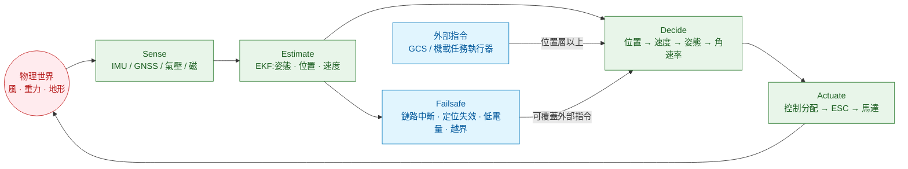

# 為什麼無人機非得長成這個樣子

一句話的答案:**因為延遲會吃掉相位裕度,而多旋翼沒有相位裕度就會翻。** 這條物理約束決定了哪些程式碼必須跑在機上、哪些可以放到雲端,也決定了整套系統為什麼要分成那幾層。搞懂這一條,後面所有架構決策都不需要死背。

這一章從「一台四旋翼要怎麼才不會摔」開始推,推到最後會得到一張分層表——那張表不是誰規定的慣例,是算出來的。

---

## 1. 起點:多旋翼本身是不穩定的

固定翼飛機在設計上可以做到靜穩定:受擾動偏了,氣動力會把它推回原姿態,飛手鬆手也不會馬上掉下來。多旋翼沒有這種東西。

四個螺旋槳提供的推力都朝著同一個方向(機體的 z 軸),推力大小可以變,但**方向完全由機體姿態決定**。機體歪了,推力就跟著歪,水平分量把機器往歪的那邊推,姿態偏差變成位置偏差,而位置偏差不會產生任何把姿態轉回來的力。這是個開迴路發散的系統:偏了就一直偏下去。

所以多旋翼能飛,靠的百分之百是控制器每秒鐘幾百次地量測、計算、修正。**沒有控制器,它連懸停一秒都做不到。** 這跟寫一個「掛了可以重啟」的服務是完全不同的處境:控制迴路停 0.2 秒,飛機就進入不可恢復的姿態。

倒立擺是最貼近的類比。一根倒立的棍子要立在手掌上,靠的是手掌持續小幅移動;手停下來,棍子就倒。四旋翼是三個軸同時在做這件事,而且手掌本身也在空中。

---

## 2. 延遲是怎麼把系統搞垮的

負回授控制器的工作是:量到偏差,施加一個反方向的修正。這件事成立的前提是**修正到達的時候,偏差還是原來那個方向**。

延遲破壞的正是這個前提。假設系統以角頻率 ω(rad/s)振盪,而你的修正晚了 τ 秒才到,那麼這個延遲在該頻率上造成的相位落後是:

```
φ = ω · τ        (弧度)
```

當相位落後累積到 180°,負回授就變成了正回授——你以為在壓制振盪,實際上在推它。控制設計時會刻意留一段緩衝,叫**相位裕度**,典型值 45°~60°。這段緩衝要分給控制器本身的動態、感測器濾波、離散取樣,留給通訊延遲的通常不超過 10°。

把 10° 當作延遲預算,換算成秒:

```
τ_max = 0.1745 / ω_c        (ω_c = 該迴路的閉迴路頻寬,rad/s)
```

代進多旋翼各層迴路的典型頻寬(量級估計,不同機型會差一兩倍):

| 迴路 | 典型更新率 | 閉迴路頻寬 ω_c | 10° 相位預算能容忍的延遲 |
|---|---|---|---|
| 角速率(rate) | 1 kHz | ~188 rad/s(30 Hz) | **0.9 ms** |
| 姿態(attitude) | 250 Hz | ~63 rad/s(10 Hz) | **2.8 ms** |
| 速度(velocity) | 50 Hz | ~12.6 rad/s(2 Hz) | **14 ms** |
| 位置(position) | 50 Hz | ~3.1 rad/s(0.5 Hz) | **56 ms** |
| 任務(navigator) | 1~10 Hz | ~0.31 rad/s(0.05 Hz) | **560 ms** |

這張表是整套架構的分水嶺。把幾個真實數字擺進去對照:

| 通道 | 典型往返延遲 |
|---|---|
| 同一塊 MCU 內的函式呼叫 | < 0.01 ms |
| SPI 讀 IMU | ~0.1 ms |
| 機上 USB / UART 到伴隨電腦 | 1~5 ms |
| 機上乙太網路 | 0.2~1 ms |
| 地面 WiFi(視距、乾淨頻段) | 5~30 ms |
| 4G / 5G 到附近的伺服器 | 30~80 ms |
| 跨區域雲端 | 100~300 ms |

對照結果很直接:

- **角速率與姿態迴路**只能跑在飛控板自己的 MCU 上。連「送到機上另一台 Linux 電腦再回來」都超支。
- **速度迴路**(14 ms)勉強可以跨機上的高速匯流排,但沒有餘裕給排程抖動,實務上不這麼做。
- **位置迴路**(56 ms)剛好落在本地 WiFi 與近端行動網路的範圍。這解釋了為什麼「用地面電腦下位置指令」可行,而且是 Offboard 模式的物理基礎。
- **任務層**(560 ms)可以放心跨雲端。任務決策晚半秒沒關係,飛機在原航段繼續飛就是了。

所以那條經常被講成慣例的「飛控在機上、任務在雲端」,其實是相位裕度算出來的結果。

### 順帶解釋:為什麼取樣率要比頻寬高那麼多

離散取樣本身就是延遲。零階保持(ZOH,取樣後把值保持到下個週期)的等效延遲約是半個取樣週期 `T/2`。要讓這個延遲在 ω_c 上造成的相位落後小到可以忽略,取樣率就得遠高於頻寬:

```
1 kHz 取樣 → T/2 = 0.5 ms → 在 188 rad/s 上落後 5.4°
```

已經吃掉一半的預算了。這就是為什麼角速率迴路是 1 kHz 而不是 100 Hz——不是因為「越快越好」的直覺,是因為算出來剛好夠用。

---

## 3. 感測器都在說謊,所以需要估測

控制器要修正偏差,前提是知道現在的姿態與位置。但每一種感測器單獨拿出來都不能用:

| 感測器 | 給你什麼 | 問題 |
|---|---|---|
| 陀螺儀 | 角速度,更新快、雜訊小 | 積分成角度會漂移,幾十秒就偏掉 |
| 加速度計 | 重力方向,長期不漂 | 飛機自己的加速度混在裡面,短期完全不可信 |
| 磁力計 | 航向 | 附近有電流、鋼筋、馬達就偏 |
| 氣壓計 | 高度變化 | 絕對值受天氣影響,螺旋槳氣流會擾動 |
| GNSS | 全球位置 | 1~10 Hz、延遲數十毫秒、都市多路徑、室內沒有 |

它們的錯法不一樣,這是關鍵:陀螺儀短期準、長期漂;加速度計短期爛、長期準。把兩者按各自的可信度加權融合,就能得到一個比任何單一來源都好的估計。這就是感測器融合的全部直覺,卡爾曼濾波器只是把「可信度」用共變異數矩陣寫成了可以遞迴計算的形式。

估測器放在哪一層?**它在控制迴路裡面。** 姿態估計晚 3 ms 到,跟量測晚 3 ms 到,對相位裕度的影響完全一樣。所以估測器必須跟控制器待在同一塊板子上,不能拆出去。

這也解釋了一個常見誤解:伴隨電腦上跑的視覺定位、SLAM,並不是「取代 EKF」,而是**當成又一種感測器餵給 EKF**(以視覺里程計的形式送進去),融合仍然發生在飛控上。

---

## 4. 於是得到那條迴路

把上面幾件事串起來,就是整套系統的核心:



四個環節缺一不可,而且**每一個環節的延遲都直接加進同一份預算**。這是除錯時最有用的一句話:飛行異常八成能定位到這條迴路上的某個節點,而且要**從內往外查**——內層壞了,外層的表現一定也是亂的,反過來不成立。

實務上的順序是:先看角速率追不追得上(內層),再看姿態,再看估測器的 innovation(量測與預測的差),最後才懷疑任務層。倒過來查會浪費大量時間在錯的層級。

---

## 5. 第二條推論:越外層越應該能斷

延遲預算決定了「誰跑在哪裡」,還有一條同樣重要的推論:**每一層對「上一層消失」的反應必須不一樣。**

| 斷掉的東西 | 系統該有的反應 |
|---|---|
| 雲端任務服務不通 | 飛機完全不受影響,繼續執行已下發的任務;地面端排隊等重連 |
| GCS 斷線 | 依設定續飛任務或返航;不可以就地停在空中等指令等到沒電 |
| 遙控器訊號中斷 | 觸發 failsafe(返航 / 降落 / 定點),依高度與距離決定 |
| 伴隨電腦當掉 | 飛控退出 Offboard,回到上一個安全模式;絕不可以繼續照最後一筆指令飛 |
| GNSS 失效 | 從位置模式降級到高度模式,交還水平控制權給操作者 |
| IMU 失效 | 沒有安全退路。這就是為什麼工業機都裝兩到三組 IMU |

這張表其實是在說:**越靠近物理世界的層,越不允許失效;越遠的層,失效必須是設計內的正常情況。** 寫雲端任務服務的人如果假設「鏈路會通」,就是把一個必然發生的事件當成異常來處理,系統一定會出事。

這裡有個容易踩的坑:Offboard 模式下,伴隨電腦如果停止送 setpoint,飛控會在數百毫秒後判定失聯並退出 Offboard。這個設計常被當成「PX4 很難用」抱怨,但它擋住的正是「伴隨電腦當掉,飛機照著最後一筆速度指令一路飛走」這種災難。理解它擋住什麼之後,程式就會寫成持續心跳,而不是想辦法繞過檢查。

---

## 6. 這一章推出來的結論

1. 多旋翼靜不穩定,所以必須有持續運作的控制迴路;迴路停 0.2 秒就不可恢復。
2. 延遲在頻率上造成相位落後 `φ = ω·τ`,吃掉相位裕度就會發散。
3. 各層迴路的延遲預算差了三個數量級(0.9 ms 到 560 ms),這是分層的物理原因,不是工程慣例。
4. 感測器各有各的錯法,融合它們的估測器在控制迴路內,所以必須跟控制器同板。
5. 越外層越必須把「斷線」當成正常路徑處理,越內層越不允許失效。

下一篇把這些結論落成具體的責任邊界:每一層負責什麼、更重要的是**不負責什麼**,以及一個新功能該放哪一層的判準。

→ [02 責任邊界:一個功能該放在哪一層](02-system-boundaries.md)

## 延伸閱讀

- 控制迴路與相位裕度的教科書處理:任何一本古典控制教材的頻域分析章節
- PX4 的實際迴路速率與模組排程:[10 飛控軟體](../10-flight-controller/)
- 估測器輸出怎麼判讀健康度:[60 模擬與測試](../60-simulation-and-testing/)
