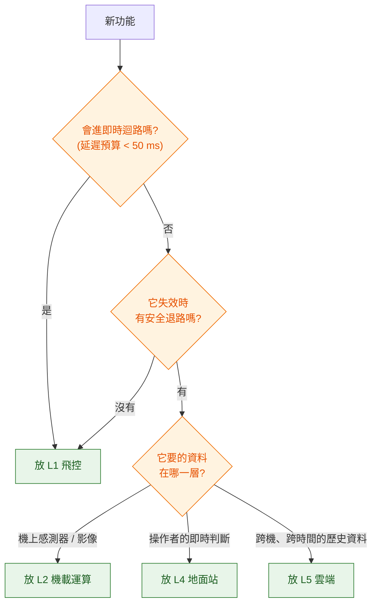

# 責任邊界:一個功能該放在哪一層

新功能該放飛控、伴隨電腦、地面站,還是雲端?這個問題每個無人機專案都會吵很多次,而且吵不出結論的原因通常是雙方各拿一個判準在講。實際上只要依序問三個問題就能定案:

1. **它會不會進即時迴路?** 延遲預算不夠就不能放外層。
2. **它失效時有沒有安全退路?** 沒有退路的東西必須放在最不容易失效的那一層。
3. **它要用的資料在哪一層才拿得到?** 資料搬不動的話,運算就得搬過去。

三個問題有先後順序:第一個問題答「會」就結束了,不必再問後面兩個。這一章把每層的責任攤開,再用一批常見的放錯案例驗證這套判準。

---

## 1. 分層與各自不負責的事

多數文件會列每一層負責什麼。實務上更有用的是**它不負責什麼**——邊界糾紛都發生在這一欄。

| 層 | 跑在哪 | 負責 | 不負責 |
|---|---|---|---|
| **L0 硬體** | 機體 | 感測器、馬達、電源、結構 | 不做任何決策 |
| **L1 飛控** | Pixhawk 類 MCU | 姿態與位置控制、狀態估計、模式管理、failsafe、航點執行 | 不懂業務語意(「巡檢第 3 根電線桿」對它沒有意義)、不做影像處理、不連網際網路 |
| **L2 機載運算** | 機上 Linux(Jetson / Pi 類) | 視覺、SLAM、目標追蹤、任務動作序列、payload 控制、影像編碼 | 不做姿態控制、不是 failsafe 的最後一道防線、不保證即時性 |
| **L3 通訊鏈路** | 無線電 / 4G / 5G | 搬位元組,提供頻寬、延遲、可靠度的取捨 | 不保證送達、不保證順序(依鏈路而定)、不做業務重試 |
| **L4 地面站** | 操作者的筆電 / 平板 | 人機介面、任務規劃、參數與韌體管理、現場監控 | 不是飛行安全的必要條件(斷了飛機要能自己處理) |
| **L5 雲端** | 資料中心 | 機隊資料、排程派工、稽核、合規上報、資料後處理 | 不進任何即時迴路、不能假設鏈路常在 |

L1 那格的「不懂業務語意」是最常被忽略的一條。飛控知道「飛到 (24.7, 121.0, 高度 60 m) 然後停 5 秒」,不知道那裡有根電線桿要拍照。把業務概念塞進飛控,代價是每次業務規則改變都要動韌體——而韌體更新是所有更新裡最貴、最危險的一種。

---

## 2. 三個判準怎麼用

### 判準一:延遲預算

用[上一篇](01-the-control-loop.md)算出來的表。門檻大致是:需要在 50 ms 內回應機體狀態變化的,就進不了外層。

判準一的變體是**頻寬**。影像每秒要搬幾 Mbps,遙測鏈路只有幾十 kbps,兩者不可能共用一條路——這不是效能問題,是量級差了兩三個數量級的問題。

### 判準二:失效退路

問法是:「這個模組當掉,系統下一步做什麼?」

如果答案是「操作者接手」或「退回上一個模式」,那它可以放外層。如果答案是「不知道」或「飛機會照最後一筆指令繼續飛」,那它必須放到有 failsafe 保護的那一層,或者為它補一個退路再往外放。

這一條解釋了為什麼 failsafe 本身永遠在 L1:**它是所有退路的終點,終點不能有退路。**

### 判準三:資料重力

運算要靠近資料。1080p 的影像串流從機上傳到雲端再回來,鏈路成本高、延遲大、還會因為斷線而中斷;把偵測模型放到機上,只回傳幾十位元組的框座標,成本差了幾個數量級。

反過來,「這台機的電池是不是比同批機衰退得快」需要跨機、跨時間的歷史資料,那些資料在雲端,運算就該在雲端。

---

## 3. 五個常見的放錯案例

### 把避障決策放雲端

**錯在判準一。** 障礙物出現到必須開始煞車,留給系統的時間通常是幾百毫秒;光是把深度影像送上雲端就超支了。

正確作法是**分層處理**:機上做「看到東西就停下來或繞開」的反射式避障(L2,必要時直接透過飛控的距離感測器介面),雲端做「這條航線經過的區域最近常有障礙,改規劃路線」的離線決策(L5)。同一個需求,兩個時間尺度,放兩層。

### 把影像塞進 MAVLink

**錯在判準一的頻寬變體。** MAVLink 是為幾十 kbps、會掉包的鏈路設計的,單封包上限只有 255 位元組的酬載。影像走這條路會把遙測擠爆,結果是姿態顯示卡頓、命令延遲——而影像自己也不會變好。

正確作法是影像走自己的通道(RTP / RTSP / WebRTC),MAVLink 只負責用 `VIDEO_STREAM_INFORMATION` 這類訊息告訴地面站「影像在哪個 URL」。**控制平面與資料平面分離**,跟後端把檔案放物件儲存、API 只回傳 URL 是同一個模式。

### 把業務任務狀態機寫進飛控韌體

**錯在判準三,而且代價特別高。** 業務規則會改,韌體更新要重新驗證、重新走安全流程,還可能要拆機。把「巡檢流程」寫進韌體,等於把最常變的東西放進最難改的地方。

正確作法是飛控只認航點與動作原語(飛到某點、盤旋多久、觸發相機),業務流程放 L2 的機載任務執行器,更高階的排程放 L5。詳見 [40 任務控制](../40-mission-control/)。

### 把 failsafe 判斷放伴隨電腦

**錯在判準二。** 伴隨電腦跑的是通用 Linux,會 OOM、會被排程器拖延、會因為某個 Python 套件的例外而整個掛掉。把「電量低要返航」交給它,等於把最後一道防線建在最會倒的那面牆上。

正確作法是 failsafe 條件與行為都設定在飛控,伴隨電腦只能**提出建議**(例如請求切換模式),不能成為安全鏈路的必要環節。

### 用雲端做多機防撞

**錯在判準一與判準二。** 兩台機相向接近的合速度可能到 20 m/s,雲端往返一次就飛掉好幾公尺;而且鏈路一斷,防撞就沒了。

正確作法分兩層:戰略層的空域分配與航線衝突偵測在雲端做(時間尺度是分鐘),戰術層的最後避讓靠機上的感測與機間直連(時間尺度是秒)。UTM 標準的設計就是這個分工。

---

## 4. 層與層之間的契約

邊界要能被檢驗,得寫成契約。以下是最少必要的幾條:

| 介面 | 上游保證 | 下游保證 | 違反時的症狀 |
|---|---|---|---|
| L1 → L2 遙測 | 以固定頻率發佈狀態,含時間戳與座標系標示 | 不假設每筆都收到,不用遙測頻率當自己的控制頻率 | 下游把掉包當成狀態異常,誤觸發保護 |
| L2 → L1 指令 | 持續送 setpoint 維持 Offboard;停送即視為放棄控制權 | 隨時可拒絕(pre-arm、geofence、failsafe 優先) | 上游沒處理 `COMMAND_ACK` 的拒絕,以為送出去就生效 |
| L2 → L1 感知輸入 | 視覺里程計附共變異數與時間戳 | 融合結果不保證採納 | 上游沒給時間戳,估測器把舊資料當新的用 |
| L4 → L5 任務 | 任務有唯一 ID,重送必須冪等 | 接受亂序與重複,以版本號決定新舊 | 網路重試造成同一任務被派兩次 |
| L5 → L4 派工 | 只下發意圖,不下發即時控制量 | 可在鏈路中斷時本地續行 | 雲端一斷,現場任務停擺 |

這些契約應該有對應的自動化測試。契約測試在後端是常識,在無人機專案裡常常缺席,結果是整合階段才發現雙方對「誰負責重試」的理解不同。

---

## 5. 邊界正在崩壞的徵兆

以下任何一項出現,通常代表某個功能放錯層了:

- 飛控韌體裡出現客戶名稱、案場名稱、業務術語
- 地面站關掉之後,飛機的行為變得無法預測
- 伴隨電腦上的某個程式掛掉會直接導致飛行事故
- 影像品質變差的同時,姿態顯示也開始卡
- 一個業務規則的調整需要重燒韌體
- 雲端連不上時,現場就不能作業
- 同一份狀態(例如「目前任務進度」)在三個地方各有一份,而且會不一致

最後一項特別值得注意。任務狀態的**唯一真相來源**必須明確:飛行中的權威在機上,地面與雲端持有的是副本;連線恢復時以機上的為準。反過來設計(以雲端為權威)會在每次斷線重連時產生衝突,而衝突解決邏輯遠比想像中難寫對。

---

## 6. 這一章的結論

1. 判斷功能放哪一層,依序問延遲預算、失效退路、資料重力,第一個問題答「會進即時迴路」就結束。
2. 每一層的「不負責什麼」比「負責什麼」更能避免爭議。
3. 常見的放錯位置——雲端避障、影像走 MAVLink、業務狀態機進韌體、failsafe 在伴隨電腦、雲端防撞——都能用這三個判準當場駁回。
4. 邊界要寫成可測試的契約,尤其是「誰負責重試」「誰是唯一真相來源」。

→ 下一章看看這個領域現在有哪些現成的開源元件可用:[05 開源生態與選型](../05-open-source-landscape/)
