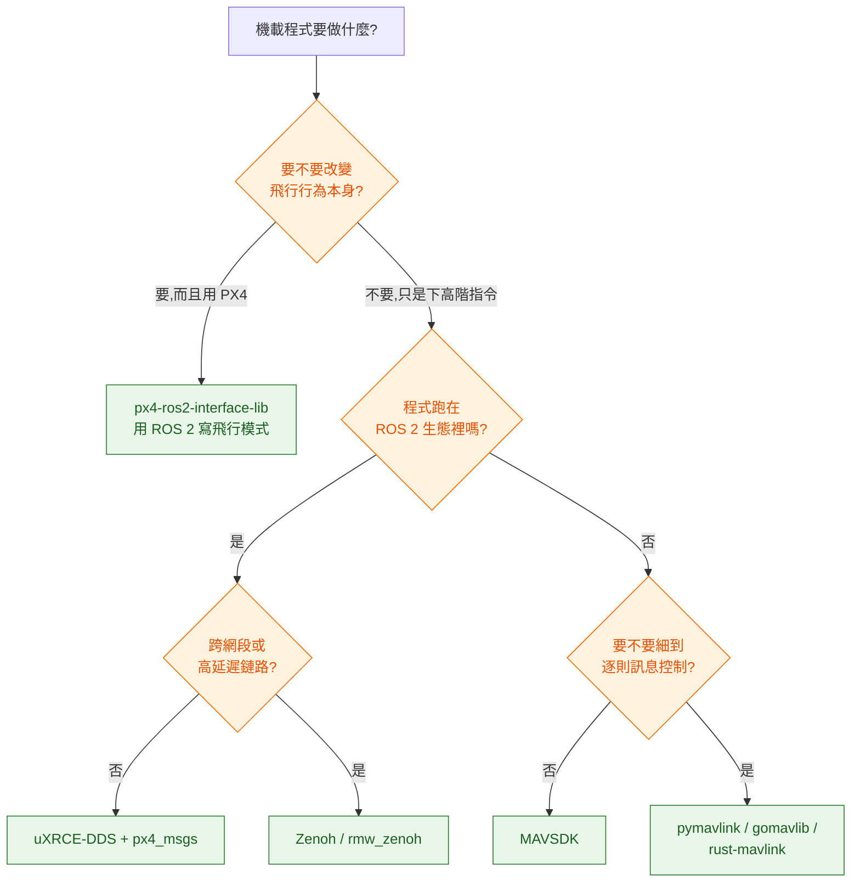

# 選型決策:四條線與三種組合

選型看起來有幾十個選項,真正會影響後續半年的只有四個決定:**用哪個飛控韌體、機載程式用什麼介面跟飛控說話、地面站自研到什麼程度、模擬器用哪一套。** 其他大多可以之後再換。

這一篇給每條線的判斷依據,然後把它們收斂成三種常見專案的組合,最後是一條「一週之內看到東西在飛」的最短路徑。

---

## 決策線一:PX4 還是 ArduPilot

| 你的情況 | 選 |
|---|---|
| 要改韌體核心而且產品要閉源 | **PX4**(BSD-3) |
| 主力開發在 ROS 2 上,要寫客製飛行模式 | **PX4**(px4-ros2-interface-lib 是 PX4 專屬) |
| 載具是水下、地面車、天線追蹤器或其他非典型機型 | **ArduPilot**(機型支援廣度沒有對手) |
| 團隊已有 ArduPilot 的調參與現場經驗 | **ArduPilot**(經驗值比帳面規格值錢) |
| 只是要用現成功能飛任務,不打算改韌體 | 兩者皆可,看硬體供應商支援哪個 |
| 需要在同一套地面軟體支援兩種韌體 | 介面層用 MAVLink / MAVSDK,不要綁 uXRCE-DDS |

沒被列進去的判準也值得說明:**社群大小、star 數、文件品質這幾項兩邊差距不大**,拿來當選型理由的說服力有限。真正的差別是授權、機型廣度、ROS 2 深度這三項。

### 一個常見的誤判

「PX4 比較新、ArduPilot 比較舊」是錯的框架。兩者都持續在動(2026-08-05 當天雙方都有推送),ArduPilot 的歷史長只代表它累積的機型支援多,不代表技術過時。反過來,PX4 的模組化設計對「要動核心」的團隊確實比較好下手,那是設計取捨,不是新舊之分。

---

## 決策線二:機載程式怎麼跟飛控說話

這條線選錯的代價最高,因為它會滲透進你所有機載程式。



各選項的實質差異:

| 選項 | 抽象層級 | 適合 | 代價 |
|---|---|---|---|
| uXRCE-DDS + px4_msgs | 低(直接看到 uORB 主題) | ROS 2 節點、要完整狀態、延遲敏感 | 綁 PX4;訊息定義隨韌體版本改變 |
| Zenoh | 低,但傳輸層不同 | 跨網段、高延遲、機隊跨網路 | PX4 端要手動啟用;liveliness 仍實驗性 |
| px4-ros2-interface-lib | 中高(飛行模式為單位) | 客製飛行行為又不想改韌體 | 版本一致性要求嚴格 |
| MAVSDK | 高(動作為單位) | 地面應用、任務腳本、快速原型 | 細節被包起來,遇到邊界情況要下鑽 |
| MAVROS | 中(MAVLink 轉 ROS 主題) | ArduPilot + ROS 2 | 在 PX4 上是舊路線 |
| pymavlink / gomavlib / rust-mavlink | 最低(逐則訊息) | 學協定、寫路由與工具、非常規需求 | 狀態機要自己寫,容易寫錯 |

實務上多數專案是**混用**的:機載即時部分走 uXRCE-DDS,地面服務走 MAVSDK 或 gomavlib,除錯工具用 pymavlink。這是合理的,不必強求統一。

值得單獨提的是 Zenoh。傳統的 DDS 是為區域網路設計的,發現機制在跨網段、NAT、高延遲的情況下很脆弱。Zenoh 從一開始就把廣域網路當成主場,對「機在現場、服務在雲端」這種拓撲更合適。PX4 從 v1.16 把它納入,v1.17 讓它跟 ROS 2 的 `rmw_zenoh` 對得起來(序列化格式對齊、lease 時間對齊、graph 能顯示出來),而 `rmw_zenoh` 在 ROS 2 已經是 Tier 1。這條路線值得關注,但要注意 PX4 端仍需手動啟用,而且 liveliness 還是實驗性的——現在把它放進生產環境的關鍵路徑會太早。

---

## 決策線三:地面站要自研多少

先問一個問題:**你要做的是「操作單機的工具」還是「管理機隊的平台」?** 這兩件事幾乎沒有重疊。

| 需求 | 建議 |
|---|---|
| 現場操作、參數校正、韌體燒錄、飛行前檢查 | 直接用 QGroundControl,不要自研 |
| 需要在 QGC 上加自家的 payload 控制介面 | 改 QGC(Apache-2.0),或寫成獨立的伴隨應用 |
| 多機隊、排程派工、稽核、跟既有系統整合 | 自研 web 平台,但**不要重做 QGC 的功能** |
| 客戶要「一個網頁看到所有機的位置」 | 自研前端 + 後端訂閱遙測,參考 ADOS Mission Control 的架構 |

自研 GCS 最常見的失敗模式是:團隊為了做機隊管理,順手把參數校正、韌體燒錄、飛行前檢查也一起重做,結果做了兩年還不如 QGC 穩。那些功能牽涉大量機型細節與硬體怪癖,QGC 已經處理了十幾年。**分工是:現場工具用 QGC,管理平台自研,兩者透過資料層而不是介面層整合。**

---

## 決策線四:模擬器

| 你要驗證什麼 | 用 |
|---|---|
| 控制律、任務狀態機、failsafe 行為、CI 回歸 | **Gazebo**(輕、快、能無頭跑、PX4 官方對齊) |
| 視覺演算法、深度估計、光照與材質影響 | **Isaac Sim**(光線追蹤、感測器保真度高) |
| 生訓練資料、強化學習 | **Isaac Sim**(GPU 平行、與 Isaac Lab 同一生態) |
| 完整任務的端到端驗收 | Gazebo 跑主線,Isaac Sim 補視覺相關的部分 |

判準很簡單:**CI 要跑幾百次的東西用 Gazebo,要看清楚一次的東西用 Isaac Sim。** 前者在意的是啟動速度與無頭執行,後者在意的是畫面與物理的真實度。

不要因為 Isaac Sim 畫面漂亮就把 CI 建在上面。它要 NVIDIA GPU、啟動慢、資源吃得多,把每次 PR 都跑一輪的成本很難撐住。

---

## 三種組合

### 組合 A:研究 / 學習 / 概念驗證

```
PX4 (SITL) + Gazebo Harmonic + ROS 2 Humble 或 Jazzy
  + px4_msgs / uXRCE-DDS
  + QGroundControl
  + pymavlink(理解協定用)
```

目標是最快看到東西動起來,而且教學資源最多。ROS 2 選 Humble 或 Jazzy 而不是最新的 Lyrical Luth,理由是第三方套件與教學文章的覆蓋率——新 distro 在釋出後半年內,常會遇到某個依賴還沒發版。

### 組合 B:巡檢 / 測繪類產品

```
PX4 或 ArduPilot(依硬體供應商)
  + mavp2p 做機上路由
  + MAVSDK 寫機載任務執行器
  + 自研雲端任務服務(任務資料模型 + 排程 + 稽核)
  + QGroundControl 當現場工具
  + OpenDroneMap 或商用方案做後處理
  + Gazebo 建 CI
```

重點在雲端那一塊要自己寫,因為任務語意與客戶流程綁得很緊,沒有現成品能直接套。其他每一層都用現成的。

### 組合 C:客製飛行行為 / 自主性研究

```
PX4 main 或最新 stable
  + px4-ros2-interface-lib 寫客製飛行模式
  + ROS 2 + Aerostack2 或 AirStack 當任務框架
  + Isaac Sim + Pegasus Simulator 驗證感知
  + Gazebo 跑 CI 回歸
```

這個組合的版本相容性最脆弱,務必把 PX4、px4_msgs、介面庫的版本鎖在一起,並且在 CI 裡驗證註冊流程能通過相容性檢查。

---

## 一週之內看到東西在飛

假設你會 Linux、Docker、Python,沒碰過飛控:

| 步驟 | 做什麼 | 預期時間 | 完成的標準 |
|---|---|---|---|
| 1 | 跑起 PX4 SITL + Gazebo | 半天 | 模擬器裡的機能起飛降落 |
| 2 | 接上 QGroundControl,規劃一條四點航線飛完 | 2 小時 | 看得到姿態、電量、模式,航線自動飛完 |
| 3 | 用 pymavlink 連上去,印出姿態與心跳 | 2 小時 | 能解釋 sysid / compid 是什麼 |
| 4 | 用 MAVSDK 寫腳本讓它自動起飛到 5 公尺再降落 | 半天 | 腳本能重複執行,失敗有明確錯誤 |
| 5 | 起 uXRCE-DDS Agent,用 ROS 2 訂閱位置 | 半天 | `ros2 topic echo` 拿得到位置 |
| 6 | 寫一個 ROS 2 節點用 Offboard 飛一個正方形 | 1 天 | 軌跡對得上,中途斷掉會安全退出 |
| 7 | 把上面整包塞進 Docker Compose,加一條整合測試 | 1 天 | `docker compose up` 之後測試會自己跑完並回報通過 |

第 7 步是多數教學會漏掉、但對軟體工程師最重要的一步:**把模擬環境變成可重複執行的測試環境。** 做完這一步,後面所有開發都有回饋迴路;跳過它,你會一直用手動點 QGC 的方式驗證,速度差十倍。

[`reference-impl/`](../../reference-impl/) 就是第 7 步的成品,可以直接拿去改。

---

## 反模式

- **一開始就買真機。** 真機是驗證場,不是學習場。前四週在 SITL 學到的東西,在真機上要花五倍時間而且會摔。
- **為了「效能」跳過抽象層,直接手刻 MAVLink 狀態機。** MAVLink 的命令確認、重送、mission protocol 的交握有一堆邊界情況,MAVSDK 已經處理過。等到你真的量到瓶頸再往下鑽。
- **用最新的所有東西。** PX4 main + ROS 2 最新 distro + Gazebo 最新版的組合,你會花大半時間在解相容性問題。先用對齊過的版本組合把主線打通。
- **把模擬當成次要工作。** 在這個領域,模擬環境的品質直接決定開發速度,它是基礎設施不是玩具。

→ [10 飛控軟體:韌體裡面到底長什麼樣](../10-flight-controller/)
