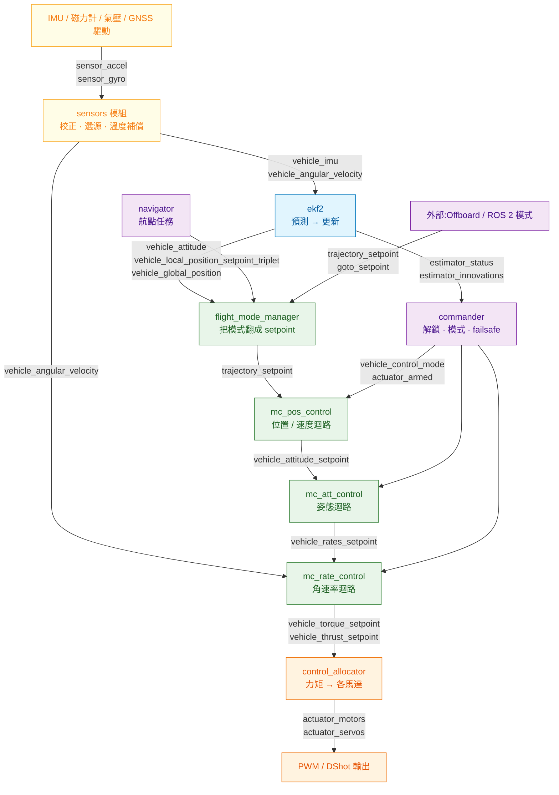
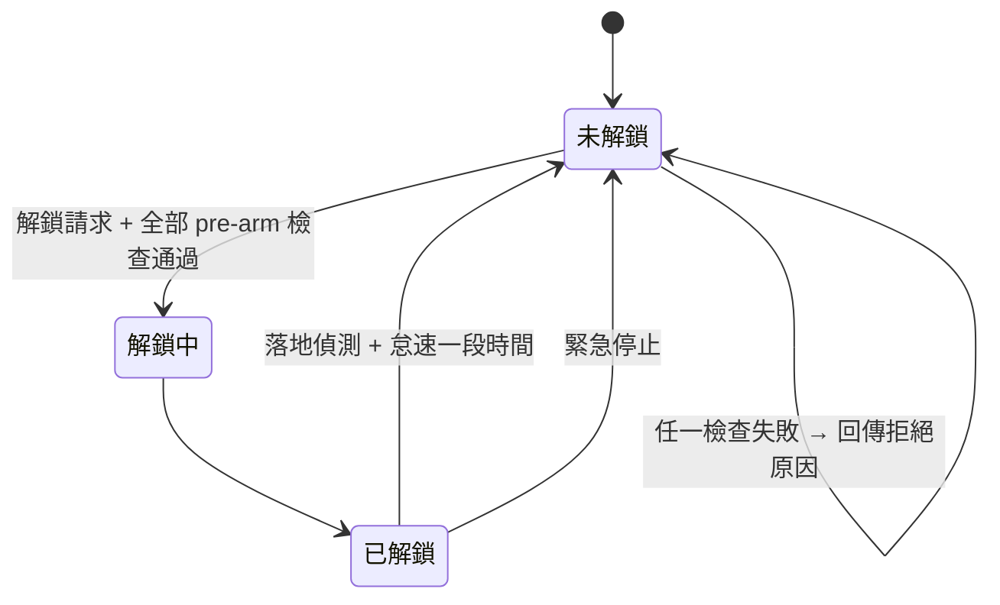

# 從感測器到馬達:資料流、狀態機與失敗模式

上一篇講飛控**怎麼組織程式碼**,這一篇講資料**怎麼流過去**:一筆 IMU 讀值進來,經過哪幾道處理才變成馬達轉速,每一道的介面是什麼、壞掉的時候會怎樣。

對軟體工程師來說,這一章的價值不在控制理論,而在**把飛控當成一條有型別的資料管線來理解**。管線的每一節都有明確的輸入輸出主題,所以除錯時可以像追分散式追蹤一樣,一節一節往回看。

---

## 1. 完整資料流



幾個一眼就該注意到的地方:

**角速率控制的輸入不經過 EKF。** `vehicle_angular_velocity` 直接從 `sensors` 送到 `mc_rate_control`。原因是延遲——陀螺儀量到的角速度已經夠準,再繞一圈估測器只會增加相位落後。這是[延遲預算](../00-system-overview/01-the-control-loop.md)在架構上的直接體現。

**外部指令只能接在中間,接不到底層。** Offboard 與 ROS 2 客製模式送的是 `trajectory_setpoint` 或 `goto_setpoint`,進的是位置迴路那一層。你沒辦法從外部直接餵 `actuator_motors`(除非刻意開啟直接致動器控制,那是給特殊研究用的,失去所有保護)。

**commander 是橫向的。** 它不在資料流上,而是**發佈控制權限**:`vehicle_control_mode` 這則訊息告訴每個控制器「你現在該不該運作、該用哪一組迴路」。所有控制器都訂閱它。這是很典型的權限與資料分離設計。

---

## 2. 為什麼是串級控制

看到位置 → 速度 → 姿態 → 角速率四層迴路串在一起,直覺會問:為什麼不寫一個大控制器,輸入位置誤差直接輸出馬達轉速?

理論上可以,實務上沒有人這樣做,理由有四個:

**時間尺度不同。** 每一層的頻寬差 5 到 10 倍。合成一個控制器等於要用最快的速率跑最慢的邏輯,浪費算力而且沒有好處。

**可以分層調參與驗證。** 內層調好之後,對外層而言它就是一個「大致會照指令執行」的元件。這讓調參變成一次處理一層,而不是同時面對十幾個互相耦合的增益。你在後端做分層架構是為了同樣的理由。

**飽和有地方處理。** 馬達推力有上限,飽和發生在最內層。串級結構讓內層可以把「我做不到」這件事回報給外層(PX4 用 `control_allocator_status` 傳遞飽和資訊),外層據此收斂積分項,避免積分飽和造成的失控。單一大控制器要處理這件事會非常難寫。

**模式切換有介入點。** 不同飛行模式其實就是「從哪一層開始接管」:Position 模式從位置層接管、Altitude 模式只接管高度與姿態、Acro 模式直接給角速率指令。串級結構讓這些模式共用底下的層,只換上面的入口。

```
Manual/Acro   ──────────────────────────────► 角速率迴路
Altitude      ────────────────► 姿態迴路 ───► 角速率迴路
Position      ──► 位置迴路 ──► 姿態迴路 ───► 角速率迴路
Mission/Offboard ─► (產生 setpoint) ─► 位置迴路 ─► ...
```

看懂這張圖,就懂了為什麼「Offboard 模式進不去」跟「Acro 模式能飛」可以同時發生:它們用的是完全不同的入口,經過的檢查也不同。

---

## 3. 估測:EKF 實際在做什麼

拋開數學,EKF 的迴圈只有兩步:

**預測。** 拿陀螺儀與加速度計的讀值,依運動學把上一時刻的狀態往前推。IMU 更新很快(幾百 Hz 以上),所以預測步跑得很密。同時,不確定度會隨著時間累積變大——因為 IMU 有雜訊與偏差,推得越久越不準。

**更新。** 當比較慢的量測到了(GNSS 位置、氣壓高度、磁力計航向、視覺里程計),拿它跟預測值比較,差值叫 **innovation**。按照「預測有多不確定」與「這個量測有多不確定」的比例,決定要往量測那邊修正多少。修正完,不確定度縮小。

於是得到一個很有用的除錯訊號:**innovation 就是「這個感測器跟我目前的信念差多少」**。它應該在零附近小幅跳動;如果某個來源的 innovation 持續偏向一邊,代表這個感測器跟其他來源說法不一致——磁力計被干擾、GNSS 有多路徑、視覺里程計尺度錯了。PX4 把這些放在 `estimator_innovations` 與 `estimator_status` 主題裡,ULog 分析工具的第一張圖通常就是它。

### 一個容易忽略的細節:量測是「過去的」

GNSS 的位置解算需要時間,拿到手上時它描述的是 100~200 毫秒之前的位置。如果直接拿來修正「現在」的狀態,會系統性地把估計往後拉。

ECL EKF 的處理方式是維持一個環形緩衝,把融合動作放在一個**延遲的時間軸**上執行(融合發生在「量測有效的那個時刻」),融合完再把結果向前傳播到當前時刻輸出給控制器。這樣控制器拿到的是即時的估計,而融合的時間對應是正確的。

這個設計對外部整合有直接影響:**你從伴隨電腦送視覺里程計進來,一定要附正確的時間戳。** 沒有時間戳或時間戳沒對齊,EKF 會把舊資料當新的用,結果是位置估計慢性漂移——而且很難查,因為每個模組單獨看都正常。

---

## 4. 控制分配:mixer 為什麼被取代

早期飛控用 mixer:一個靜態矩陣,把 roll / pitch / yaw / thrust 四個控制量線性組合成各馬達的輸出。四旋翼的矩陣就四行四列,寫死在設定檔裡。

這個做法的極限在**飽和與失效**。當某個馬達已經滿轉,矩陣還是照算,結果是輸出被截斷,實際產生的力矩跟控制器以為的不一樣,而控制器並不知道。更糟的是馬達失效:一顆槳掉了,矩陣完全不知情。

現代作法(PX4 從 v1.13 起的 `control_allocator`)把它變成一個帶約束的分配問題:

```
輸入:控制器要的力矩 τ 與推力 T(vehicle_torque_setpoint / vehicle_thrust_setpoint)
已知:機體幾何 —— 每顆馬達的位置、轉向、槳的推力係數,構成 effectiveness matrix
求解:各馬達的輸出,滿足 0 ≤ uᵢ ≤ 1,使實際產生的力矩盡量接近 τ
輸出:actuator_motors / actuator_servos
回報:control_allocator_status —— 哪個軸飽和了、飽和多少
```

好處是實在的:機體幾何從設定檔描述,不用為每種機型手寫矩陣;飽和狀態會回報給控制器讓它處理積分項;馬達失效時可以更新矩陣重新分配(這是「四旋翼掉一顆槳還能降落」那類研究的基礎)。

對軟體工程師的類比:mixer 是寫死的路由表,control allocator 是帶約束的最佳化求解器加上健康回報。

---

## 5. commander:解鎖、模式、failsafe

`commander` 是飛控裡最像後端服務的模組——它幾乎不碰數學,全是狀態機與規則。

### 解鎖狀態機



Pre-arm 檢查是一長串條件:感測器有沒有校正、EKF 收斂了沒、GNSS 精度夠不夠(依模式而定)、電池電壓、遙控器有沒有連上、geofence 設定合不合理、SD 卡在不在。**任何一項不過就拒絕解鎖,並回傳具體原因。**

這是新手最常撞牆的地方,而心態要調整過來:**這些檢查不是找麻煩,是把「起飛後才發現」的問題提前到地面。** 寫外部程式時的正確做法是解析拒絕原因並顯示給使用者,而不是重試或想辦法繞過。

### 模式切換會被拒絕

模式切換是請求,不是命令。切到 Position 模式需要位置估計有效;切到 Mission 需要有已上傳的任務;切到 Offboard 需要**外部已經在持續送 setpoint**。條件不滿足就拒絕,並透過 `vehicle_command_ack` 回傳結果。

Offboard 的預熱要求特別值得說明它擋住了什麼。如果允許「先切模式再送指令」,那麼在切換完成到第一筆指令抵達之間,飛機處於「歸外部控制、但外部還沒說話」的狀態——它該做什麼?這段真空期沒有安全的定義。要求先送再切,就消除了這個狀態。

### Failsafe 的優先權

failsafe 條件與行為是設定出來的,不是寫死的,但有明確的優先權概念:**越危急的條件優先權越高,而且已經觸發的高優先權行為不會被低優先權的請求覆蓋。**

| 條件 | 典型行為 |
|---|---|
| 電池嚴重不足 | 就地降落 |
| 電池不足 | 返航 |
| 遙控器訊號中斷 | 依設定返航或降落 |
| 地面站鏈路中斷 | 依設定續行任務或返航 |
| 位置估計失效 | 降級到高度模式,交還水平控制 |
| 超出 geofence | 依設定返航、降落或僅警告 |
| Offboard 訊號中斷 | 退出 Offboard,回到上一個安全模式 |

PX4 把當下所有觸發中的條件放在 `failsafe_flags` 主題裡。做地面軟體時,顯示這個比顯示一個籠統的「異常」有用得多。

---

## 6. 失敗模式:症狀對照該看的資料

| 症狀 | 先看什麼 | 常見原因 |
|---|---|---|
| 高頻抖動、馬達聲音尖 | 角速率迴路的追蹤誤差、震動頻譜 | 角速率增益過高;機架共振傳到 IMU |
| 低頻搖晃、像在畫圈 | 姿態與位置迴路的追蹤誤差 | 外層增益過高;或內層根本沒調好 |
| 定點時緩慢繞圈 | 磁力計的 innovation、航向估計 | 磁干擾造成航向錯誤 |
| 高度慢慢往下掉或往上飄 | 氣壓計 innovation、推力估計 | 氣壓受氣流擾動;懸停推力估計偏差 |
| 位置突然跳一下 | GNSS 相關的 innovation 與衛星數 | 多路徑或短暫失鎖 |
| 解鎖被拒絕 | 拒絕原因訊息、pre-arm 檢查項 | 照著訊息修,不要猜 |
| Offboard 切不進去 | `vehicle_command_ack` 的結果碼 | setpoint 沒有先送、或頻率不足 |
| 飛行中突然退出 Offboard | `failsafe_flags` | 外部送的 setpoint 斷了 |
| 起飛後立刻翻覆 | 馬達編號與轉向、機型設定 | 輸出對應接錯 |

最後一項值得強調:**起飛翻覆幾乎都是輸出對應或轉向錯誤,不是控制參數問題。** 這種錯誤在模擬裡驗不出來(模擬器用的是正確的對應),所以真機第一次上電前的馬達測試不能跳過。

---

## 7. 對外契約:versioned messages

PX4 的 `msg/` 底下分成兩區:一般訊息,以及 `msg/versioned/`。後者是**刻意穩定下來、當作外部 API 的那一批**,包含 `TrajectorySetpoint`、`GotoSetpoint`、`VehicleAttitude`、`VehicleLocalPosition`、`VehicleStatus`、`VehicleCommand` 等等。

比例值得記一下:v1.17.0 有 244 則 uORB 訊息,**只有 34 則在 `msg/versioned/`**。技術上兩區沒有差別,伴隨電腦都訂閱得到;差別在承諾——versioned 的那批改動會顧及相容性,其餘 210 則可能在任何一個版本改掉欄位而不另行通知。逐則的欄位與常數見[附錄](appendix/uorb-all-topics.md)。

這解決的是一個很現實的問題:飛控韌體與伴隨電腦上的 ROS 2 程式是分開更新的,韌體改了訊息定義,機載程式就爆掉。PX4 從 v1.16 起提供訊息版本轉換節點,能在不同版本的定義之間做動態轉換。

`msg/versioned/` 裡還有一組值得注意的訊息:`RegisterExtComponentRequest` / `RegisterExtComponentReply`、`ArmingCheckRequest` / `ArmingCheckReply`、`ModeCompleted`、`ConfigOverrides`。它們構成了**外部元件註冊機制**——伴隨電腦上的程式可以向飛控註冊自己是一個飛行模式、參與 pre-arm 檢查、回報模式完成。這正是 `px4-ros2-interface-lib` 底下的機制,下一篇會展開。

從軟體工程的角度看,這是一個成熟度指標:飛控韌體開始把「外部擴充」當成第一級的介面來設計,而不是要你去改它的原始碼。

---

## 8. 這一章的結論

1. 飛控是一條有型別的資料管線,每一節的介面都是具名的 uORB 主題,除錯可以逐節往回追。
2. 角速率迴路不吃估測結果,直接用陀螺儀,為的是省延遲。
3. 串級控制的四個理由:時間尺度、分層調參、飽和回報、模式切換的介入點。
4. EKF 的 innovation 是最有用的健康指標;外部送進來的量測一定要附正確時間戳。
5. control allocator 取代 mixer,因為它能處理飽和與失效並回報,而靜態矩陣不能。
6. commander 是純狀態機:pre-arm 檢查、模式請求可被拒絕、failsafe 有優先權。
7. `msg/versioned/` 是對外的穩定契約,外部元件註冊機制讓客製行為不必改韌體。

→ [03 擴充與測試:什麼時候該改韌體](03-extending-and-testing.md)
