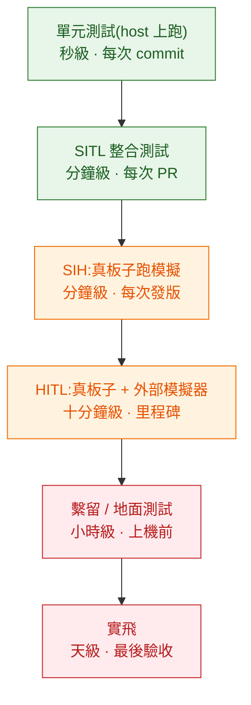

# 擴充與測試:什麼時候該改韌體

「我們的需求飛控做不到,要改韌體」——這句話在專案裡出現時,通常有八成的機率不必真的改。這一篇給三條擴充路徑與選擇它們的判準,然後講飛控軟體怎麼測,因為擴充的成本大半在驗證,不在寫程式。

---

## 1. 三條路徑

| 路徑 | 程式跑在哪 | 延遲 | 斷線後 | 更新成本 | 驗證成本 |
|---|---|---|---|---|---|
| **A. 改韌體模組** | 飛控 MCU | 最低(µs 級) | 完全不受影響 | 重燒韌體 | 高:要重測整份韌體 |
| **B. ROS 2 註冊模式** | 伴隨電腦 | 低(ms 級) | 飛控自動 fallback | 重啟一個行程 | 中:模式層級可獨立測 |
| **C. 純外部指令** | 任何地方 | 中(ms~百 ms) | 飛控退出該模式 | 部署一支程式 | 低 |

### 選擇的判準

**先問延遲。** 需要跟角速率或姿態迴路同步(1~5 ms)的東西,只能走 A。除此之外,幾乎都不需要 A。

**再問失效行為。** 這個功能失效時,飛機該怎麼辦?如果答案是「必須繼續有某種行為」,那它得在飛控上。如果答案是「退回一般模式讓操作者接手」就可以走 B 或 C。

**最後問更新頻率。** 會隨業務規則改變的東西不要放韌體。韌體更新要重新驗證、可能要拆機、出錯的代價最高。

實際會用到 A 的情況比想像中少:新的感測器驅動、新的載具型態(控制律本身不同)、要改控制分配的行為、要在 pre-arm 檢查裡加硬性條件。**「加一個客製飛行行為」現在幾乎都應該走 B。**

---

## 2. 路徑 A:改韌體要動哪些檔案

以「新增一個模組」為例,PX4 的最小改動集合:

```
src/modules/my_module/
  ├── CMakeLists.txt          # px4_add_module(...) 宣告模組名、優先權、原始檔
  ├── MyModule.hpp/.cpp       # 繼承 ModuleBase / ModuleParams / px4::WorkItem
  └── module.yaml             # 參數定義(名稱、型別、預設值、範圍、說明)

msg/MyModuleStatus.msg        # 若要發佈新的 uORB 主題
msg/CMakeLists.txt            # 把新訊息加進去

boards/px4/fmu-v6x/default.px4board   # 宣告這塊板子的韌體要包含此模組
ROMFS/px4fmu_common/init.d/rc.mc_apps # 啟動腳本裡加上 my_module start
```

幾個容易踩的點:

**flash 空間是有限的。** 加模組會擠掉別的東西。板子的設定檔就是在做取捨,不是形式。

**參數的中繼資料不是註解。** `module.yaml` 裡宣告的範圍、單位、說明會被抽取出來給地面站用。少寫,你的參數在 QGC 上就是一個沒有說明的裸數字。

**新的 uORB 主題預設不會被記錄。** logger 有一份主題清單,新主題要加進去才會出現在 ULog 裡。這件事常被忘記,結果是「明明加了狀態輸出,飛完卻找不到」。

**別在即時路徑上做記憶體配置。** 啟動時配置好,執行期只用既有的緩衝。

ArduPilot 的對應概念不同(它用 `AP_` 前綴的函式庫與排程表),但要動的地方是同一組:程式碼、參數宣告、排程註冊、記錄項目。

---

## 3. 路徑 B:用 ROS 2 寫一個飛行模式

這是這幾年最值得注意的變化。`px4-ros2-interface-lib` 讓你在伴隨電腦上用 C++ 寫一個飛行模式,**動態註冊進 PX4**,地面站看到的是一個像原生模式的選項。

機制建立在[上一篇](02-estimation-and-control.md)提到的那組 versioned messages 上:

| 訊息 | 做什麼 |
|---|---|
| `RegisterExtComponentRequest` / `Reply` | 外部元件向飛控報到,取得模式代號 |
| `ArmingCheckRequest` / `Reply` | 飛控詢問外部元件「你準備好了嗎」,外部可以否決解鎖 |
| `ModeCompleted` | 外部模式回報「我做完了」,讓任務可以接續 |
| `ConfigOverrides` | 外部模式宣告要暫時覆蓋哪些設定 |
| `TrajectorySetpoint` / `GotoSetpoint` / 各層 setpoint | 模式實際輸出的控制目標 |

這組介面的設計值得欣賞,因為它把幾件事同時處理掉了:

**它是雙向的。** 外部模式不只是送指令,還參與 pre-arm 檢查——你的視覺定位還沒收斂,可以直接讓飛控拒絕解鎖。這比「在自己的程式裡檢查然後不送指令」安全得多,因為後者擋不住操作者從遙控器解鎖。

**它有 fallback。** 模式失效時,PX4 會退回內建模式。走純 Offboard 的話,失效就是退出 Offboard;走註冊模式的話,可以宣告「我要取代 Position 模式,我掛了就用原本的 Position」。

**它有版本檢查。** 註冊時比對訊息定義版本,不相容就直接拒絕,而不是在飛行中因為欄位偏移而行為詭異。

代價是**版本一致性要求嚴格**:PX4 韌體、`px4_msgs`、介面庫三者要對齊。實務上要把版本鎖進建置設定,並在 CI 裡驗證註冊流程能通過。

---

## 4. 路徑 C:純外部

用 MAVSDK 或 MAVLink 直接下高階指令:上傳任務、切模式、送 Offboard setpoint、控制雲台。不需要任何飛控端改動。

多數應用停在這一層就夠了,而且應該優先嘗試這一層。它的限制是**飛行行為只能從既有模式裡組合**——你可以讓它飛到某點、盤旋、拍照,但沒辦法定義一個全新的飛行邏輯。

---

## 5. 飛控軟體的測試金字塔

飛控的測試層級比一般後端多兩層,因為中間有「模擬」與「真硬體但不飛」這兩個階段:



| 層級 | 抓得到什麼 | 抓不到什麼 |
|---|---|---|
| 單元測試 | 數學函式、狀態轉換、邊界條件 | 時序、整合、真實動力學 |
| SITL | 模式切換、任務流程、failsafe 邏輯、控制律的定性行為 | 真實硬體的時序、驅動問題、CPU 負載 |
| SIH(Simulation-In-Hardware) | 在**真的飛控板上**跑內建模擬,驗證韌體在真實 MCU 上的即時性與 CPU 佔用 | 真實感測器雜訊、真實電磁環境 |
| HITL | 真板子接外部模擬器,驗證完整韌體與周邊 | 真實振動、氣流、電池行為 |
| 繫留 / 地面 | 馬達轉向與編號、震動、電流、遙控器對應 | 飛行中的動態行為 |
| 實飛 | 一切 | — |

PX4 對應的實際工具:單元測試在 host 上編譯執行;SITL 整合測試放在 `test/mavsdk_tests`(用 MAVSDK 寫的情境測試)與 `test/ros_tests`;SIH 是 `simulator_sih` 模組,可以直接在飛控板上跑;模擬用的感測器則由 `sensor_baro_sim`、`sensor_gps_sim`、`sensor_mag_sim` 這些模組提供。

**這條金字塔對軟體工程師最重要的一句話是:SITL 跑的是真的韌體。** 它不是簡化模型,是把感測器與致動器換成模擬訊號的同一份程式碼。所以在 SITL 通過的模式切換邏輯、failsafe 邏輯、任務流程,在真機上行為一致。會不一致的是時序與硬體相關的部分——而那正是 SIH 與 HITL 要補的。

---

## 6. 故障注入與重播

兩個容易被忽略、但價值很高的工具:

**故障注入。** PX4 有 `failure_injection_manager` 模組,可以在模擬中人為讓某個感測器失效、讓 GNSS 消失、讓馬達停轉,然後觀察系統反應。這讓「failsafe 到底有沒有用」變成可測試的事情,而不是希望它有用。

沒有故障注入的話,failsafe 的測試只能靠真機拔天線這種土法,而那既危險又不可重複。

**重播。** `replay` 模組把記錄下來的感測器資料重新餵進估測器與控制器。派得上場的時候:
- 現場飛出一個怪現象,回來改程式碼,用同一份資料驗證修好了沒
- 調整 EKF 參數時,拿同一批飛行資料比對不同設定的估測品質
- 回歸測試:確認新版本在歷史資料上的行為沒有變差

這兩個工具加起來,等於把「飛行」變成可重複的輸入。對習慣了確定性測試的軟體工程師來說,這是把這個領域拉回熟悉地面的關鍵。

---

## 7. 回歸測試該測什麼

如果你要為一個無人機專案建 CI,以下是投資報酬率最高的一組(全部在 SITL 跑得動):

| 測試 | 驗什麼 | 失敗代表 |
|---|---|---|
| 起飛 → 懸停 → 降落 | 基本控制鏈路 | 動到了控制或估測,而且動壞了 |
| 上傳並飛完一條多航點任務 | mission protocol 交握、navigator | 任務上傳或執行的相容性破了 |
| 進入 Offboard、飛一段、停止送 setpoint | Offboard 進入條件與退出行為 | 外部控制的契約壞了 |
| 模擬遙控器中斷 | failsafe 觸發與行為 | 安全行為被改壞 |
| 模擬 GNSS 失效 | 估測降級與模式退化 | 降級路徑壞了 |
| 電量下降到門檻 | 低電返航 | 門檻設定或行為錯誤 |
| geofence 越界 | 邊界行為 | 圍欄判斷錯誤 |
| 從 ULog 檢查關鍵指標區間 | 追蹤誤差、innovation、CPU 佔用 | 效能或估測品質退化 |

最後一項是很多團隊沒做的:**把飛完之後的 ULog 拿來做斷言。** 「有飛完」跟「飛得好」是兩件事;追蹤誤差變大兩倍但任務仍然完成的話,前面七項測試都會過。把關鍵指標的合理區間寫成斷言,才擋得住這種退化。

---

## 8. 這一章的結論

1. 三條擴充路徑依延遲、失效行為、更新頻率選擇;需要改韌體的情況比直覺少很多。
2. 改韌體的最小改動集合是:模組程式、參數宣告、板子設定、啟動腳本、記錄清單,漏掉最後一項會讓新狀態無法事後分析。
3. `px4-ros2-interface-lib` 讓客製飛行行為可以跑在伴隨電腦上並註冊回飛控,還能參與 pre-arm 檢查、擁有 fallback,代價是版本必須鎖緊。
4. 測試金字塔比一般後端多了 SITL、SIH、HITL 三層,各自抓不同類型的問題。
5. SITL 跑的是真的韌體,所以邏輯層的驗證結果可以外推到真機;時序與硬體問題要靠 SIH / HITL。
6. 故障注入與重播把飛行變成可重複的輸入,是把這個領域拉回確定性測試的關鍵工具。

→ [20 通訊協定:MAVLink 為什麼長這樣](../20-protocols/)
