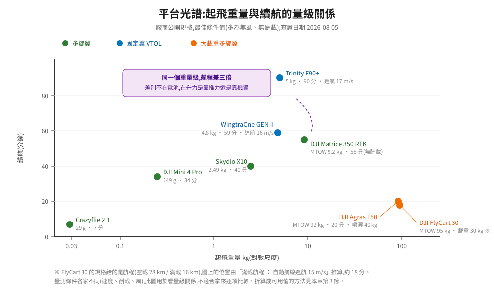
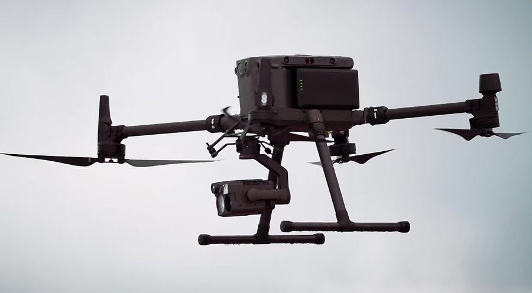

# 機體參數:規格書上的數字怎麼讀

寫任務服務的人遲早會問一個問題:「這台機到底能飛多遠?」規格書上寫著續航 55 分鐘、巡航 16 m/s,乘一乘好像可以飛 26 公里。實際排任務時照這個數字派工,飛機會在半路上觸發返航。

問題不在廠商灌水,而在**規格書上的數字是最佳條件下量的**:無風、無酬載、特定溫度、特定飛行剖面。任務規劃需要的是另一組數字,而那組數字要從機體參數推。這一章先把各類平台的實際規格攤開,再推出幾條「參數之間的關係」——那些關係才是規劃時真正在用的東西。

---

## 1. 各類平台的實際參數

以下數字取自廠商公開規格,查證日期 2026-08-05,來源連結在文末。**都是最佳條件值**,怎麼折算成可用值見第 3 節。

| 類別 | 機型 | 重量 | 尺寸 | 續航 | 速度 | 酬載 | 抗風 |
|---|---|---|---|---|---|---|---|
| 微型研究 | Crazyflie 2.1 | 起飛重 29 g | 92×92×29 mm | 約 7 分 | — | 建議上限 15 g | — |
| 消費輕型 | DJI Mini 4 Pro | < 249 g | 展開 298×373×101 mm | 34 分(標準電池)/ 45 分(Plus) | 最大水平 16 m/s | — | 10.7 m/s |
| 開發平台 | Holybro X500 V2 | 機架 610 g | 軸距 500 mm | 約 18 分(懸停、無酬載、5000 mAh) | — | 1500 g(不含電池,70% 油門) | — |
| 工業多旋翼 | DJI Matrice 350 RTK | 不含電池 3.77 kg;含雙電池 6.47 kg;MTOW 9.2 kg | — | 55 分(約 8 m/s、無酬載、無風) | 最大水平 23 m/s | 2.7 kg | 12 m/s |
| 自主巡檢 | Skydio X10 | 空重 2.11 kg(含電池);MTOW 2.49 kg | — | 40 分 | 最大 72 km/h(20 m/s) | 385 g | 約 12.5 m/s |
| 物流 | DJI FlyCart 30 | MTOW 95 kg(滿載) | — | 航程 28 km 空載 / 16 km 滿載 | 自動航線最大 15 m/s;手動最大 20 m/s | 30 kg(雙電池模式) | — |
| 農噴 | DJI Agras T50 | 不含電池 39.9 kg;含電池 52 kg;MTOW 92 kg(噴灑)/ 103 kg(播撒) | 展開 2800×3085×820 mm | 約 20 分 | — | 40 kg 噴灑 / 50 kg 播撒 | — |
| VTOL 測繪 | WingtraOne GEN II | MTOW 4.8 kg | 翼展 1.25 m | 59 分 | 巡航 16 m/s | 800 g | 持續 12 m/s、陣風 18 m/s |
| VTOL 長航程 | Quantum Trinity F90+ | MTOW 5 kg | 翼展 2.394 m | 90 分 | 巡航 17 m/s | 700 g | 12 m/s |

<p align="center">
  
</p>

### 這張表最該注意的三件事

**續航的量測條件不同,不能直接比。** M350 的 55 分鐘是「約 8 m/s、無酬載、無風」量的;它掛上雙光吊艙之後不會是這個數字。WingtraOne 的 59 分鐘是巡航狀態,而巡航對固定翼來說就是正常工況。**拿兩個機型的續航數字直接相減,幾乎一定是錯的比較。**

**「續航」與「航程」是兩個不同的規格。** FlyCart 30 給的是航程(28 km / 16 km),因為物流關心的是能送多遠;測繪機給的是續航,因為關心的是一趟能掃多少面積。看到規格書只給其中一個,要自己用巡航速度換算另一個,並且知道換算會失真。

**抗風上限不等於可作業風速。** 標示 12 m/s 的意思是「機體在這個風速下還控制得住」,不是「在這個風速下任務做得完」。原因在下一章的風速計算——12 m/s 的風對一台巡航 16 m/s 的機來說,往返時間會變成兩倍以上。

---

## 2. 分類的實質差異

把上表按物理特性重新歸類,會看到三組完全不同的機器:

| | 多旋翼 | 固定翼 / VTOL | 大載重多旋翼 |
|---|---|---|---|
| 升力來源 | 全靠推力 | 機翼(巡航時) | 全靠推力 |
| 能不能懸停 | 能 | 固定翼段不能 | 能 |
| 最小轉彎半徑 | 0 | 數十公尺 | 0 |
| 單位電量的覆蓋距離 | 低 | **高 2~4 倍** | 最低 |
| 起降需求 | 一個平面 | VTOL 同多旋翼;純固定翼要跑道 | 大平面 + 淨空 |
| 適合 | 定點作業、小區域、需要懸停 | 大面積測繪、長距離巡線 | 載重運輸、農噴 |

**單位電量的覆蓋距離**是最能區分它們的指標。用上表算一下「續航 × 巡航速度」得到的最大航程:

| 機型 | 續航 | 巡航速度 | 理論航程 |
|---|---|---|---|
| Matrice 350 RTK | 55 分 | 8 m/s(量測條件) | 約 26 km |
| WingtraOne GEN II | 59 分 | 16 m/s | 約 57 km |
| Trinity F90+ | 90 分 | 17 m/s | 約 92 km |

三台的起飛重量都在 5~9 kg 這個級距,航程卻差了三倍多。差別不在電池,在**升力怎麼產生**:多旋翼全程用推力頂住重量,固定翼在巡航時靠機翼產生升力,而機翼的升阻比讓同樣的能量能推更遠。

這件事對規劃的直接影響:**任務是「掃一片區域」還是「在幾個點停留」,決定了該選哪一類機**,而不是反過來先挑機再想任務。

---

## 3. 從規格值折算到可用值

### 懸停功率與重量的關係

多旋翼的續航折損不是線性的。從動量理論(把螺旋槳當成一個推動空氣的圓盤)可以推出懸停所需功率:

```
P_hover = T^1.5 / √(2 ρ A)

T = 總推力 = m g(懸停時)
ρ = 空氣密度
A = 槳盤總面積
```

代入 `T = mg` 得到 **`P ∝ m^1.5`**。兩個立刻可用的推論:

**加酬載的續航折損是超線性的。** 起飛重量增加 20%,懸停功率增加 `1.2^1.5 ≈ 1.32`,續航掉到原本的 76%。增加 40% 重量,功率增加 `1.4^1.5 ≈ 1.66`,續航只剩 60%。

用 M350 試算:含雙電池 6.47 kg,掛滿 2.7 kg 酬載後約 9.2 kg,質量比 1.42,功率比約 1.70,標稱 55 分鐘的續航推算到約 32 分鐘。**這只是推算,實際值要看廠商對特定酬載組合的公布數字或自己實測**,但它說明一件事:規格書的最大續航跟任務時的續航是兩個數字,而且差距很大。

**加大槳盤比加大電池有效。** 因為 `P ∝ 1/√A`,槳盤面積加倍,懸停功率降到 71%。這就是為什麼長航時機型的槳看起來大得不成比例——那不是造型,是這條式子。反過來,加電池會同時增加 `m`(讓 `P` 上升 `m^1.5`)與能量(線性上升),所以存在一個最佳電池重量,超過就得不償失。

### 實務上的折算係數

從標稱續航到「可以拿來排任務的續航」,經驗上要連續打幾折:

| 折損項 | 典型係數 | 原因 |
|---|---|---|
| 酬載 | `(m_total/m_base)^-1.5` | 上面那條式子 |
| 電池保留 | × 0.7~0.8 | 不放到底,而且低電量時電壓下降會加速衰退 |
| 起降與爬升 | 減去固定的分鐘數 | 爬升功率遠高於巡航 |
| 溫度 | 低溫再打 8~9 折 | 電池內阻上升 |
| 電池循環衰退 | 依循環數 | 用了兩百次的電池不是新的 |
| 風 | 見下一章 | 逆風段的地速下降 |

疊起來很容易只剩標稱值的一半。**排任務時用的應該是這個數字,不是規格書上的數字。**

---

## 4. 這些參數該存在哪裡

回到[機隊資料模型](../50-gcs-and-cloud/02-fleet-and-data.md):機體參數不是文件裡的附註,是系統要用的資料。至少要有這幾個欄位,而且要能被任務服務讀到:

| 欄位 | 用途 |
|---|---|
| 空重、MTOW、目前酬載重量 | 算可用續航、檢查是否超重 |
| 標稱續航與量測條件 | 折算的起點 |
| 巡航速度、最大速度 | 算轉場時間與任務時間 |
| 抗風上限 | 對照天氣預報決定能不能飛 |
| 最小轉彎半徑(固定翼) | 航線幾何檢查 |
| 最大爬升 / 下降率 | 垂直機動的時間估算 |
| 槳盤面積或推重比 | 需要自己推算功率時用 |
| 電池型號、循環數、健康度 | 折算可用能量 |

**「這台機現在能不能執行這個任務」應該是系統算得出來的,而不是靠調度員記住。** 下一章把這些參數變成航跡規劃的實際約束。

---

## 5. 這一章的結論

1. 規格書的續航是最佳條件值(無風、無酬載、特定剖面),不能直接拿來排任務。
2. 「續航」與「航程」是不同規格,互相換算會失真;抗風上限也不等於可作業風速。
3. 多旋翼、固定翼 / VTOL、大載重三類機的差別在升力怎麼產生,反映在「單位電量的覆蓋距離」差 2~4 倍。
4. 懸停功率 `P ∝ m^1.5`:加酬載的續航折損是超線性的;而 `P ∝ 1/√A` 表示加大槳盤比加大電池有效。
5. 從標稱到可用要連續打折(酬載、電池保留、起降、溫度、衰退、風),疊起來常只剩一半。
6. 機體參數要進資料模型,可飛性判斷才能由系統算出來。

## 資料來源

| 機型 | 來源 |
|---|---|
| DJI Matrice 350 RTK | [DJI 官方規格](https://enterprise.dji.com/matrice-350-rtk/specs) |
| DJI Mini 4 Pro | [DJI 官方規格](https://www.dji.com/mini-4-pro/specs) |
| DJI FlyCart 30 | [DJI 官方頁面](https://www.dji.com/flycart-30) |
| DJI Agras T50 | [DJI 官方規格](https://ag.dji.com/t50/specs) |
| Skydio X10 | [Skydio 官方頁面](https://www.skydio.com/x10) |
| Holybro X500 V2 | [Holybro 產品頁](https://holybro.com/products/px4-development-kit-x500-v2) |
| WingtraOne GEN II | [Wingtra 技術規格](https://wingtra.com/mapping-drone-wingtraone/technical-specifications/) |
| Quantum Trinity F90+ | [Quantum Systems 型錄](https://optron.com/quantum-systems/wp-content/uploads/2022/02/ds_quantum-trinity-f90.pdf) |
| Crazyflie 2.1 | [Bitcraze 產品頁](https://www.bitcraze.io/products/old-products/crazyflie-2-1/) |

沒有收錄廠商的官方產品照,因為那些照片有版權,放進公開 repo 會有授權問題;
上表的連結就是官方頁面,照片在那裡看得到。本 repo 收錄的照片全部是自由授權素材,
見 [`img/photos/CREDITS.md`](../../img/photos/CREDITS.md)。

<p align="center">
  
  <br><sub>工業多旋翼的典型外型:摺疊機臂、下掛雲台、雙電池。圖為 DJI Matrice 300(CC BY 3.0)</sub>
</p>

→ [02 從飛行包絡到航跡規劃](02-trajectory-and-planning.md)
