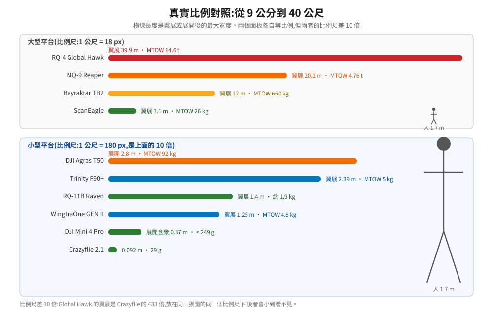
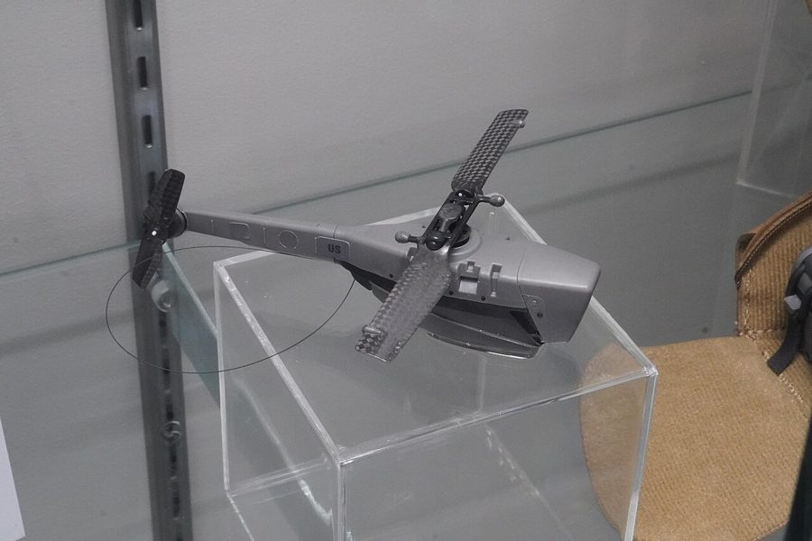
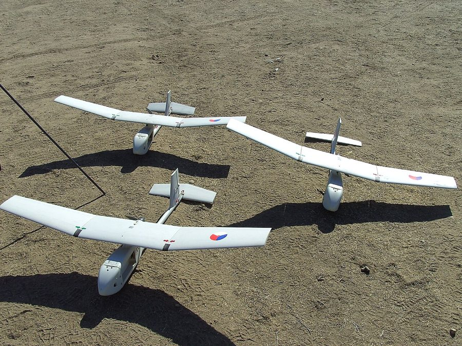
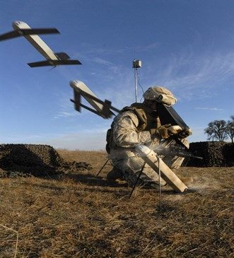
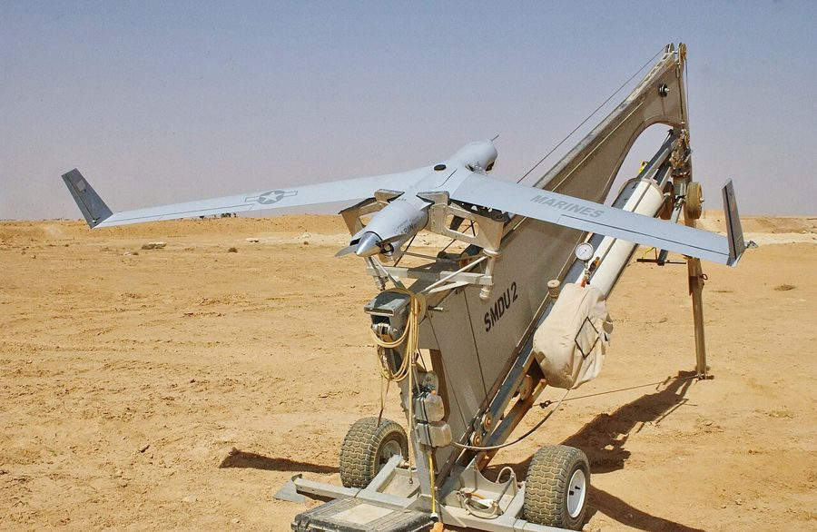
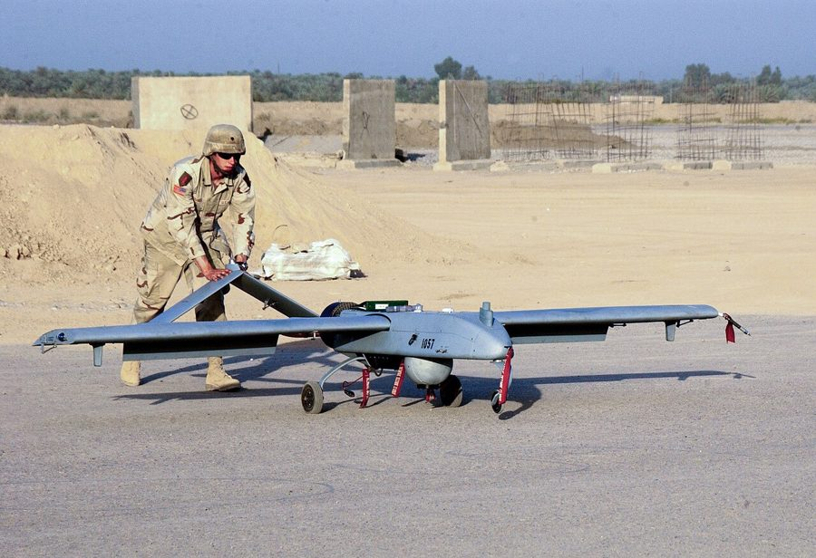
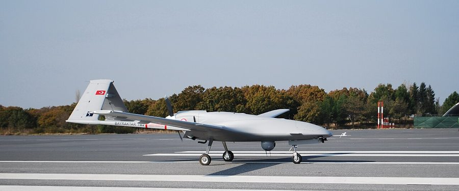
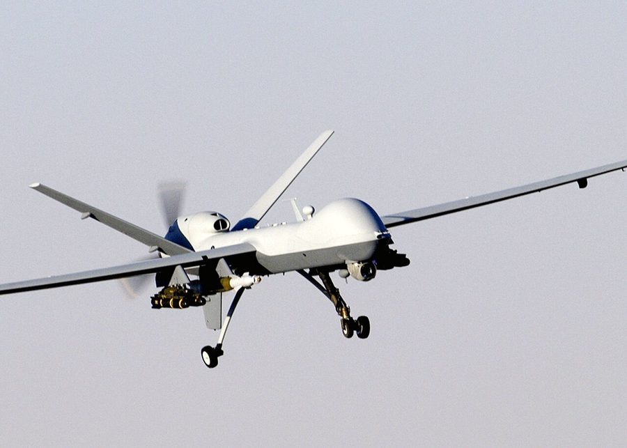
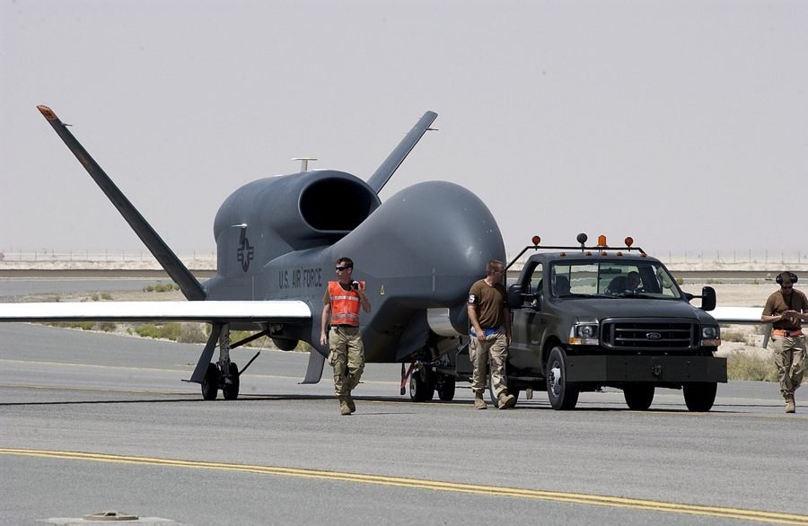

# 軍用平台:同樣的架構,推到極端

把軍用無人機放進這份專論,不是因為讀者要去做軍工。是因為**它們把「機體參數決定軟體架構」這條規律推到最極端,規律因此看得最清楚。**

一台飛 27 小時、離操作員一千公里、透過衛星鏈路控制的飛機,前面幾章講的每一條原則都還成立,只是每個數字都被放大幾個數量級——而放大之後,那些在小型機上可以偷懶的地方就完全不能偷懶了。這一章用公開的規格資料把這件事講完。

---

## 1. 一套按包絡切的分類

美國國防部把無人機分成五個 Group,而分類依據正好是這份專論在談的東西:**重量、慣用高度、速度**。

| Group | 最大起飛重量 | 慣用高度 | 速度 | 代表平台 |
|---|---|---|---|---|
| 1 | 0~20 lb(約 9 kg 以下) | < 1,200 ft AGL | 約 100 節以下 | RQ-11 Raven、Wasp、Puma |
| 2 | 21~55 lb(約 9~25 kg) | < 3,500 ft AGL | < 250 節 | ScanEagle、Flexrotor |
| 3 | < 1,320 lb(約 600 kg 以下) | < FL180 | < 250 節 | RQ-7B Shadow、RQ-21 Blackjack、V-BAT |
| 4 | > 1,320 lb | < FL180 | 不限 | MQ-1C Gray Eagle、MQ-8B Fire Scout |
| 5 | > 1,320 lb | > FL180 | 不限 | MQ-9 Reaper、RQ-4 Global Hawk、MQ-4C Triton |

值得注意的是 Group 4 與 5 的差別**不在重量,在高度**。飛得比 FL180(約 5,500 公尺)高,就要進入受管制空域,而那一刻整套系統的要求會跳一級:空管協調、detect-and-avoid、應答機、與有人機共域的責任。**這是一條軟體邊界,不只是飛行邊界。**

商用機幾乎全部落在 Group 1 與 2:[前面提過](01-platform-parameters.md)的 DJI Matrice 350 RTK(MTOW 9.2 kg)剛好在 Group 1 與 2 的交界,Agras T50(MTOW 92 kg)則落在 Group 3。

---

## 2. 規格與外觀

以下規格取自各國官方 fact sheet 與製造商公開資料,查證日期 2026-08-05,來源列在文末。

| 平台 | Group | MTOW | 翼展 | 續航 | 速度 | 酬載 | 升限 | 通訊 |
|---|---|---|---|---|---|---|---|---|
| Black Hornet 4 | 微型(Group 1 內) | 約 70 g | — | > 30 分 | — | 內建感測器 | — | > 3 km |
| RQ-11B Raven | 1 | 約 1.9 kg | 1.4 m | 60~90 分 | — | 內建感測器 | — | 視距約 10 km |
| Switchblade 300 | 1(徘徊彈) | 2.5 kg | — | 約 10 分(Block 20:20+ 分) | — | 一體式 | — | 10 km(Block 20:30 km) |
| ScanEagle | 2 | 26 kg | 3.1 m | 20+ 小時 | 巡航 111 km/h | 3.4 kg | 5,900 m | 視距 100 km |
| RQ-7A Shadow | 3 | 149 kg(滿載) | 約 3.9 m | 5 小時(RQ-7B 為 7 小時) | — | — | 約 4,300 m | — |
| Bayraktar TB2 | 4 | 650 kg | 12 m | 24 小時 | 巡航 100 km/h | 150 kg | 8,230 m | — |
| MQ-9 Reaper | 5 | 4,760 kg | 20.1 m | 27+ 小時 | 巡航 150~170 節 | 1,701 kg | 15,420 m | 衛星(BLOS) |
| RQ-4 Global Hawk | 5(HALE) | 14,628 kg | 39.9 m | 32+ 小時 | 約 575 km/h | 1,360 kg | 18,300 m | 衛星(BLOS) |

<p align="center">
  
</p>

照片看不出 40 公尺翼展與 9 公分機身的差距,所以上面那張比例圖是必要的補充。下面是各級距的實際樣貌:

| | |
|:---:|:---:|
| <br>**Black Hornet**(約 70 g)<br>單兵攜行,手掌大小 | <br>**RQ-11 Raven**(Group 1,1.9 kg)<br>手拋起飛,不需要任何起降設施 |
| <br>**Switchblade 300**(徘徊彈)<br>管式發射,單程任務 | <br>**ScanEagle**(Group 2,26 kg)<br>氣壓彈射起飛、天鉤攔阻回收 |
| <br>**RQ-7 Shadow**(Group 3)<br>彈射起飛,需要專用場地 | <br>**Bayraktar TB2**(Group 4,650 kg)<br>跑道起降,續航 24 小時 |
| <br>**MQ-9 Reaper**(Group 5,4.76 t)<br>翼展 20 m,衛星鏈路超視距 | <br>**RQ-4 Global Hawk**(Group 5 HALE,14.6 t)<br>翼展 39.9 m,升限 18 km |

照片來源與授權見 [`img/photos/CREDITS.md`](../../img/photos/CREDITS.md)。全部取自 Wikimedia Commons 的自由授權素材(公有領域、CC0、CC BY、CC BY-SA)。

---

## 3. 規格推出來的五個軟體結論

### 續航從分鐘變成數十小時 → 任務狀態必須能交接

一台飛 27 小時的飛機,操作員會換三到四班。這代表:

- **任務狀態不能綁在某個操作員的連線裡。** 換班要能在不中斷飛行的前提下交接控制權,而交接本身要是一個有紀錄、可稽核的動作。
- **狀態要能完整重建。** 接手的人必須在幾分鐘內搞清楚「現在在做什麼、做到哪、為什麼是這樣」。這正是[事件溯源](../40-mission-control/03-cloud-mission-service.md)在這個領域的價值。
- **地面站不能是單點。** 主控站故障要能移交給備援站。

商用機飛 30 分鐘,這些問題可以靠「同一個人從頭盯到尾」繞過去。飛 27 小時繞不過去。

### 超視距 → 延遲讓機上自主變成必需,不是加分項

BLOS(Beyond Line Of Sight,超視距)平台靠衛星鏈路控制。算一下延遲:

```
地球同步軌道高度 ≈ 35,786 km
地面站 → 衛星 → 飛機:2 × 35,786 / 299,792 ≈ 239 ms
飛機 → 衛星 → 地面站:再 239 ms
往返純光速傳播 ≈ 477 ms
加上調變解調、編碼、緩衝,實務上常見 600~800 ms
```

把這個數字放回[延遲預算表](../00-system-overview/01-the-control-loop.md):

| 迴路 | 預算 | 衛星鏈路的 477 ms 夠不夠 |
|---|---|---|
| 角速率 | 0.9 ms | 差 500 倍 |
| 姿態 | 2.8 ms | 差 170 倍 |
| 位置 | 56 ms | 差 8.5 倍 |
| 任務決策 | 560 ms | **勉強,而且沒有餘裕** |

結論很硬:**透過衛星,地面能做的只有任務層的意圖下達,連位置指令都超支。** 所以 BLOS 平台一定要有自動起降、自動航線執行、鏈路中斷後的預授權行為——這不是為了炫技,是物理上沒有別的選擇。

這其實就是[三層任務控制](../40-mission-control/01-three-layers.md)的極端版本:遠端下意圖、機上執行、飛控保底。差別只在於商用機的鏈路斷掉是偶發,BLOS 平台的高延遲是常態。

### 起降方式決定了起降場是不是有限資源

看上面的照片會發現一件事:**Group 越大,起降越麻煩。**

| 起降方式 | 平台 | 對任務排程的意涵 |
|---|---|---|
| 手拋 / 垂直起降 | Raven、多旋翼 | 起降點幾乎不受限,不必排隊 |
| 管式發射 | Switchblade | 一次性,無回收 |
| 彈射 + 攔阻回收 | ScanEagle、Shadow | 起降設備是**有限資源**,要排隊、要人力 |
| 跑道 | TB2、MQ-9、Global Hawk | 跑道時段是排程的硬約束,還要跟有人機共用 |

對任務服務的直接影響:**起降場必須進資料模型,而且要當成有容量上限的資源來排程。** 這在[機隊資料模型](../50-gcs-and-cloud/02-fleet-and-data.md)裡列過,而在大型平台上它從「最好有」變成「沒有就排不出班表」。

### 失效後果的量級 → 冗餘與飛行終止

4.76 噸的東西掉下來跟 249 公克掉下來不是同一件事。所以大型平台的設計裡有小型機看不到的東西:

- **多重飛控與多重感測器**,而且是真正的表決式冗餘,不是「備援待命」。
- **獨立的飛行終止系統**:與主飛控完全分離的通道,能在最壞情況下強制終止飛行。
- **失效行為要事先授權**:鏈路中斷後飛什麼航線、多久之後終止,這些是任務前就核定的參數,不是現場決定的。

這對軟體的意義是:**安全鏈路不能跟功能鏈路共用元件。** 前面章節說「failsafe 是所有退路的終點」,在這個級距要更進一步——終點本身要有獨立的實作與獨立的驗證。

### 單程任務:狀態機沒有返航分支

徘徊彈(Switchblade 這類)在軟體上是個有意思的特例:**它的任務狀態機裡沒有「返航」這條路徑。**

前面幾章的任務執行器設計,大量假設「出事就退回安全狀態、回家」。單程任務把這個假設拿掉之後,整個設計會變:中止的語意變成「安全地不作用」而不是「回來」;能量預算不必保留回程;而[恢復策略](../40-mission-control/02-onboard-executor.md)裡的 CONTINUE 與 RESTART 多半不適用。

值得寫下來,是因為它提醒一件事:**你的狀態機裡有多少分支是建立在「可以回家」這個假設上?** 商用系統裡也有類似的情況——電量真的不夠時,「就地降落」跟「返航」是兩種完全不同的收尾,而多數程式只寫了後者。

---

## 4. 哪些經驗可以互相搬,哪些不行

| 可以從軍用搬到商用 | 說明 |
|---|---|
| 鏈路中斷的預授權行為 | 事前定義好、寫進任務,而不是臨場決定 |
| 操作員交接的流程與紀錄 | 長時間任務、跨班別營運都用得到 |
| 起降場當成有限資源排程 | 多機隊營運遲早會遇到 |
| 安全鏈路與功能鏈路分離 | 只是規模不同,原則一樣 |

| 不能直接搬 | 說明 |
|---|---|
| 認證等級 | 航空級軟體認證(DO-178C 這類)的成本結構跟商用開發完全不同,不是「多寫點測試」 |
| 冗餘架構 | 三重表決式冗餘對一台 5 kg 的機是重量與成本上的災難 |
| 專用頻譜與加密鏈路 | 商用受頻譜法規限制,拿不到同樣的通道 |
| 自主等級的法規空間 | 民用空域對自主飛行的容許度低得多 |

**技術棧本身其實是相通的**——PX4 與 ArduPilot 的分層控制、狀態估計、任務狀態機這些概念,在大型平台上同樣成立。差別在驗證的嚴格度與失效的代價,而那兩件事會反過來決定開發流程長什麼樣。

---

## 5. 這一章的結論

1. DoD 的 Group 1~5 是按重量、高度、速度切的;Group 4 與 5 的差別在高度而非重量——飛進受管制空域是一條軟體邊界。
2. 商用機幾乎都在 Group 1~2;Agras T50 這類大載重農噴機已經落在 Group 3。
3. 續航到數十小時後,任務狀態必須支援操作員交接,而且要能完整重建。
4. 衛星鏈路的純光速往返就是 477 ms,超過位置迴路預算 8.5 倍——BLOS 平台的機上自主是物理必需,不是加分項。
5. 起降方式從手拋到跑道,決定了起降場是不是排程上的有限資源。
6. 失效代價的量級決定冗餘等級:安全鏈路要與功能鏈路分離,並有獨立的飛行終止通道。
7. 單程任務的狀態機沒有返航分支——這反過來提醒你檢查自己的設計裡有多少假設建立在「可以回家」上。

## 資料來源

| 項目 | 來源 |
|---|---|
| DoD UAS Group 分類 | [Congressional Research Service, Defense Primer: Categories of Uncrewed Aircraft Systems](https://www.congress.gov/crs-product/IF12797) |
| MQ-9 Reaper | [U.S. Air Force fact sheet](https://www.af.mil/About-Us/Fact-Sheets/Display/Article/104470/mq-9-reaper/) |
| RQ-4 Global Hawk | [Air & Space Forces Magazine, RQ-4 資料頁](https://www.airandspaceforces.com/weapons/rq-4/) |
| RQ-11B Raven | [U.S. Army, RQ-11B Raven SUAS](https://www.army.mil/article/137604/rq_11b_raven_small_unmanned_aircraft_systems_suas) |
| RQ-7 Shadow | [militaryfactory, AAI RQ-7 Shadow](https://www.militaryfactory.com/aircraft/detail.php?aircraft_id=326) |
| ScanEagle | [Insitu 產品頁](https://www.insitu.com/products/scaneagle) |
| Bayraktar TB2 | [Army Technology, Bayraktar TB2 Tactical UAV](https://www.army-technology.com/projects/bayraktar-tb2-tactical-uav/) |
| Black Hornet | [Army Technology, Black Hornet PRS](https://www.army-technology.com/projects/black-hornet-personal-reconnaissance-system/) |
| Switchblade 300 | [AeroVironment 產品頁](https://www.avinc.com/solution/switchblade-300-block-20/) |

→ 回 [15 章索引](README.md),或看 [40 任務控制](../40-mission-control/) 怎麼把這些約束落成程式
