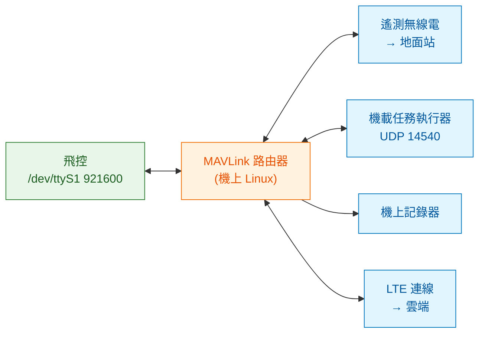

# 路由、頻寬預算與安全

飛控只有一個序列埠,但要同時餵給地面遙測、伴隨電腦、機上記錄器。鏈路只有幾 kB/s,但每個人都想多要一點資料。這一章處理這兩個現實問題,順便說明為什麼「先算預算再決定速率」比「調到不掉包為止」有效得多。

---

## 1. 為什麼需要路由器

一個序列埠只能被一個行程開啟。要讓多個消費者同時拿到 MAVLink,有三種做法:

| 做法 | 問題 |
|---|---|
| 每個程式輪流開關序列埠 | 會漏資料,而且互相搶 |
| 用 `socat` 之類的工具做管線複製 | 上行沒問題,下行(多個來源要寫入同一個埠)會交錯損壞封包 |
| **MAVLink 路由器** | 正解 |

路由器做的事情不只是複製:它**以封包為單位**處理,所以下行的多來源寫入不會把封包切碎;它看得懂 sysid / compid,所以能只把該給你的轉給你;它能做協定版本轉換與訊息過濾。

常見的兩個實作是 `mavlink-router`(C,經典)與 `mavp2p`(Go,單一執行檔、設定簡單)。典型的機上拓撲:



### 路由規則的實質

路由器轉發時的判斷大致是:目標是廣播就轉給所有其他端點;目標指定了某個 sysid / compid,就只轉給「曾經在那個端點上看過該來源」的方向。這個「學習」行為跟乙太網路交換器的 MAC 學習是同一個概念。

實務上要注意的是**環路**。兩台路由器互接又都設成廣播,封包會不斷繞圈,把鏈路吃光。設定多路由時務必畫出拓撲圖,確認沒有環。

---

## 2. 頻寬預算:先算再調

遙測鏈路的容量比多數人的直覺小很多。以常見的 57600 bps SiK 無線電為例:

```
57600 bps ÷ 10 bit/位元組(8N1)= 5760 位元組/秒(理論上限)
扣掉無線電本身的協定與糾錯開銷,實際可用約 3000 位元組/秒(量級估計,依設定與距離變化)
```

再看訊息有多大。MAVLink v2 的固定開銷是 12 位元組,加上酬載:

| 訊息 | 酬載 | 整包 | 說明 |
|---|---|---|---|
| `HEARTBEAT` | 9 B | 21 B | 存活與模式 |
| `SYS_STATUS` | 31 B | 43 B | 感測器健康、電壓電流 |
| `ATTITUDE` | 28 B | 40 B | 時間戳 + 三軸角度 + 三軸角速度 |
| `GLOBAL_POSITION_INT` | 28 B | 40 B | 經緯高 + 速度 + 航向 |
| `GPS_RAW_INT` | 30 B | 42 B | 原始定位與精度 |
| `VFR_HUD` | 20 B | 32 B | 空速、地速、高度、爬升率 |
| `BATTERY_STATUS` | 36 B | 48 B | 含 10 個電芯電壓欄位 |
| `RC_CHANNELS` | 42 B | 54 B | 18 個通道 |
| `HIGHRES_IMU` | 62 B | 74 B | 13 個浮點數的原始感測值 |

(酬載大小由訊息定義的欄位型別直接推算;v2 會截斷尾端的零位元組,實際傳輸常更小。)

把一組合理的遙測配置加起來:

| 訊息 | 頻率 | 佔用 |
|---|---|---|
| `HEARTBEAT` | 1 Hz | 21 B/s |
| `SYS_STATUS` | 1 Hz | 43 B/s |
| `ATTITUDE` | 10 Hz | 400 B/s |
| `GLOBAL_POSITION_INT` | 10 Hz | 400 B/s |
| `GPS_RAW_INT` | 5 Hz | 210 B/s |
| `VFR_HUD` | 4 Hz | 128 B/s |
| `BATTERY_STATUS` | 1 Hz | 48 B/s |
| `RC_CHANNELS` | 2 Hz | 108 B/s |
| **合計** | | **約 1360 B/s** |

佔可用頻寬的 45% 左右,還留了餘裕給命令、參數讀寫與狀態訊息。這是一個健康的配置。

現在看幾個常見的踩雷:

- **把 `ATTITUDE` 拉到 50 Hz**:單這一則就 2000 B/s,總量衝到 2960 B/s,鏈路飽和。症狀是所有東西一起變慢、命令延遲、參數讀取逾時——**而且看起來不像頻寬問題,像是「飛控變慢了」。**
- **開啟 `HIGHRES_IMU` 50 Hz**:3700 B/s,單一訊息就超過整條鏈路的容量。
- **傳影像**:1080p H.264 以 4 Mbps 計算是 50 萬位元組/秒,是這條遙測鏈路的 **167 倍**。這就是「影像必須走自己的通道」的數量級證據。

### 怎麼調

原則是**按用途分配,不是按「有沒有需要」分配**。地面站要顯示給人看,10 Hz 的姿態已經比人眼的判讀能力快;要做飛行後分析,那應該記在機上的 ULog 裡(機上寫入沒有頻寬問題),而不是透過鏈路傳下來。

PX4 與 ArduPilot 都提供分組的串流速率參數,可以針對不同鏈路設不同配置。合理的做法是:**高速鏈路(機上 USB / 乙太網路)給伴隨電腦,設高速率;窄頻鏈路(遙測無線電)只給地面站,設保守速率。** 路由器可以針對不同端點做過濾,不必所有人共用同一組設定。

---

## 3. 多鏈路的重複與分工

現場常見的配置是同時有兩條路:近距離用遙測無線電,遠距離用 LTE。兩條都通的時候,地面站會收到兩份一模一樣的訊息。

這件事的處理方式有三種:

| 做法 | 適用 |
|---|---|
| 接收端依 `SEQ` 去重 | 簡單,但兩條路的 `SEQ` 是同一個來源產生的,可行 |
| 主備切換:平時只用一條,斷了才切 | 切換有空窗,但頻寬乾淨 |
| 分工:遙測走無線電、影像與大量資料走 LTE | 最省,但兩條路的失效模式不同,要分別處理 |

多數產品採第三種,並在應用層明確定義「哪些資料保證從哪條路來」。**最糟的做法是不處理**,讓兩份資料交錯進入地面站——狀態顯示會抖,而且看起來像是飛控在跳。

---

## 4. 安全:先講清楚威脅模型

MAVLink 預設是明文、無驗證。討論安全之前先把威脅列清楚,否則很容易做了一堆加密卻沒擋住真正的風險:

| 威脅 | 後果 | 對策 |
|---|---|---|
| 竊聽遙測 | 洩漏位置與任務內容 | 鏈路加密或 VPN 隧道 |
| 偽造命令 | 惡意下達降落、解除 | **MAVLink v2 簽章**(來源驗證 + 重放保護) |
| 重放舊封包 | 重複執行某個命令 | 簽章含時間戳 |
| 干擾遙測頻段 | 失去鏈路 | 這是 failsafe 的職責,不是協定的 |
| GNSS 欺騙 | 位置估計被帶偏 | 多來源交叉驗證、慣性一致性檢查 |
| 韌體供應鏈 | 植入後門 | 韌體簽章與安全開機 |
| 機上 Linux 被入侵 | 全部失守 | 一般的主機安全:最小權限、唯讀根檔案系統、不開對外埠 |

幾個實務建議:

**簽章解決的是驗證,不是保密。** 內容仍然是明文。要保密就把 MAVLink 跑在加密隧道裡(WireGuard 之類),這也是多數團隊的做法——比在協定層做加密更容易維護,而且順便解決 NAT 與漫遊。

**別忘了機上那台 Linux。** 很多團隊在協定安全上花很多力氣,卻讓伴隨電腦開著預設密碼的 SSH。攻擊者拿到那台機器就直接擁有飛控的序列埠,任何協定層防護都無效。

**Remote ID 是另一回事。** 它的目的是讓別人**知道**你是誰、你在哪,是刻意公開的資訊,跟保密的需求方向相反。設計時不要把兩件事混在一起。詳見[50 章](../50-gcs-and-cloud/)。

---

## 5. 除錯這一層的工具

| 工具 | 用途 |
|---|---|
| `pymavlink` 的 `mavlogdump` | 把 tlog / ULog 裡的 MAVLink 訊息倒成可讀格式 |
| 路由器的統計輸出 | 每個端點的收發計數與掉包統計 |
| Wireshark 的 MAVLink 解析器 | 看 UDP 上的封包,含解出來的欄位 |
| 地面站的鏈路狀態面板 | 掉包率與訊號強度的即時觀察 |
| 自己寫的最小接收器 | 二十行 `pymavlink` 就能印出所有收到的訊息型別與頻率 |

最後一項最被低估。當你懷疑「某個訊息沒送出來」時,寫一支只做統計的小程式(訊息型別 → 每秒幾則),十分鐘就能把問題定位到是沒發、被過濾、還是掉包。比在地面站的介面上猜有效得多。

---

## 6. 這一章的結論

1. 一個序列埠多個消費者必須用 MAVLink 路由器,它以封包為單位轉發,並依 sysid / compid 學習方向。
2. 57600 bps 的鏈路實際可用約 3000 B/s;一組合理的遙測配置約佔 45%。
3. 把 `ATTITUDE` 從 10 Hz 調到 50 Hz 就會讓鏈路飽和,而症狀看起來不像頻寬問題。
4. 影像的頻寬需求是遙測鏈路的百倍以上,必須走獨立通道。
5. 高速鏈路與窄頻鏈路應該配不同的串流速率,路由器可以分別過濾。
6. 簽章提供驗證不提供保密;要保密就跑在加密隧道裡;而機上 Linux 的主機安全常是最弱的一環。

→ [30 機載運算:機上那台 Linux 該放什麼](../30-companion-compute/)
