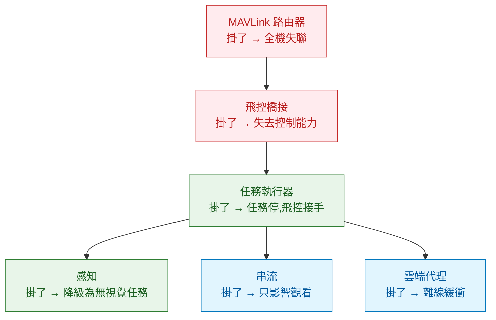

# 機上那台 Linux:定位、介面與兩個對齊問題

伴隨電腦(companion computer)是機上的 Linux 機器,跑視覺、決策、串流、任務邏輯。對軟體工程師來說這是最舒服的一層——熟悉的作業系統、熟悉的語言、熟悉的工具鏈。也因此最容易犯的錯是**把它當成一台普通的伺服器來對待**。

它不是。它會震動、會過熱、會在飛行途中因為電壓下降而重開,而且它掛掉的時候飛機還在天上。這一章講怎麼在這些前提下設計它,以及兩個幾乎每個專案都會踩的對齊問題:時間與座標系。

---

## 1. 這台機器的定位

| 性質 | 伴隨電腦 | 一般伺服器 |
|---|---|---|
| 即時性 | 軟即時,偶爾遲到可接受 | 無 |
| 可用性要求 | 掛了要能安全退場,不能拖累飛行 | 掛了服務中斷 |
| 資源 | 幾 GB 記憶體,有熱與功耗上限 | 相對充裕 |
| 存取 | 飛行中完全碰不到 | 隨時 SSH |
| 電源 | 跟著飛機,可能瞬斷 | 穩定 |
| 環境 | 震動、溫差、電磁干擾 | 機房 |

從這張表推出幾條設計原則:

**假設隨時會重啟。** 任何狀態如果重啟後就消失,那它不能是關鍵狀態。任務進度、目標清單、已完成項目要落地到檔案或資料庫,而且要能從中間恢復。

**開機到能用的時間很重要。** 飛行中重啟一次,如果要 90 秒才能重新接上飛控並恢復任務,那等於整段任務廢掉。開機路徑要精簡,而且要有明確的「就緒」訊號。

**電力瞬斷會毀檔案系統。** 根檔案系統掛成唯讀、資料寫在獨立分割區、使用有日誌的檔案系統,這些在伺服器上是選配,在這裡是必需。

**熱是真的問題。** Jetson 類的模組跑滿載會降頻。地面測試沒事、飛起來風大反而更涼,但停在地面待命時最容易過熱——實際的熱測試要包含「地面待命」這個情境,不能只測飛行。

---

## 2. 該放什麼、不該放什麼

回到[責任邊界的三個判準](../00-system-overview/02-system-boundaries.md):

| 放這裡 | 理由 |
|---|---|
| 影像擷取、編碼、串流 | 資料重力:影像在機上,搬下去太貴 |
| 物件偵測、追蹤、SLAM | 同上,而且需要低延遲 |
| 任務動作序列與狀態機 | 業務邏輯會改,不該進韌體 |
| 雲台與酬載控制 | 跟感知綁在一起 |
| 與雲端的通訊、離線緩衝 | 需要網路堆疊與儲存 |
| 資料錄製 | 需要大容量儲存 |

| 不要放這裡 | 理由 |
|---|---|
| 姿態或角速率控制 | 延遲預算不夠 |
| Failsafe 的判斷與執行 | 這台機器本身就是會失效的東西 |
| 解鎖與模式切換的最終權限 | 飛控才是權威 |
| 唯一一份的飛行紀錄 | 它可能重啟或損毀;飛控的 ULog 是更可靠的來源 |

---

## 3. 行程模型與失效隔離

機上通常會有這幾個行程:MAVLink 路由器、與飛控溝通的橋接(uXRCE-DDS agent 或 MAVSDK 應用)、感知、任務執行器、串流、與雲端的連線代理。

設計時的重點是**失效隔離**:



分級的意義在於**重啟策略不同**:上面兩個要有 systemd 的自動重啟與看門狗;中間兩個重啟時要能從持久化狀態恢復;下面兩個掛了記錄一下就好,不要因此重啟整台機器。

一個常見的錯誤是把所有東西寫成一個大行程。感知模組因為某張影像的例外而崩潰,結果連 MAVLink 路由都一起死掉——本來只會失去視覺功能,變成整機失聯。

### 容器要不要用

值得,但要注意兩件事:**容器的啟動時間會加進開機路徑**(用精簡的映像檔,不要把整包 CUDA 開發環境塞進去),以及**裝置存取要規劃好**(序列埠、相機、GPU 的權限與掛載)。實務上常見的分法是感知與任務邏輯跑容器,路由器與橋接直接跑在主機上,因為它們要碰硬體而且要最先起來。

---

## 4. 第一個對齊問題:時間

伴隨電腦與飛控是兩個獨立的時鐘。飛控用開機以來的微秒數,伴隨電腦用 UNIX 時間;兩邊都會漂移,而且沒有共同的 GPS 授時的話,誤差可以到幾百毫秒。

這件事會壞掉的地方:

- **視覺量測送進 EKF**:時間戳錯了,估測器會把舊資料當新的,造成慢性漂移([前面講過](../10-flight-controller/02-estimation-and-control.md))。
- **影像與姿態對齊**:要把畫面裡的像素反算成地面座標,必須知道「拍這張時飛機的姿態」。差 50 毫秒,在轉動中的機體上可以造成好幾度的誤差。
- **事後分析**:飛控的 ULog 與機上的錄影對不起來,查問題時無法交叉比對。

處理方式,由粗到細:

| 方法 | 精度 | 適用 |
|---|---|---|
| MAVLink 的時間同步訊息 | 毫秒級 | 一般任務邏輯 |
| NTP(機上跑一個伺服器) | 毫秒級 | 多台機器之間 |
| PTP(需要網路硬體支援) | 微秒級 | 高精度感測器融合 |
| 相機硬體觸發 + 飛控時間戳 | 微秒級 | 測繪、精準定位 |
| GNSS 的秒脈衝授時 | 奈秒級 | 需要絕對時間對齊時 |

**選擇的判準是你的誤差預算。** 做一般巡檢,毫秒級就夠;做公分級測繪,相機曝光的瞬間必須有硬體時間戳,軟體時間戳的抖動就足以毀掉精度。

模擬環境還有一個額外的坑:SITL 用的是模擬時間,而 ROS 2 節點預設用系統時鐘。忘記設定使用模擬時間的話,所有時間相關的邏輯都會錯,而且症狀很難解讀。

---

## 5. 第二個對齊問題:座標系

這是整個領域最會浪費工程師時間的問題,而且症狀通常是「飛反方向」這種讓人懷疑人生的表現。

兩套慣例:

| | 世界座標 | 機體座標 |
|---|---|---|
| **PX4 內部** | NED:x 向北、y 向東、**z 向下** | FRD:x 向前、y 向右、**z 向下** |
| **ROS 2 慣例** | ENU:x 向東、y 向北、**z 向上** | FLU:x 向前、y 向左、**z 向上** |

轉換關係:

```
NED → ENU:  (x, y, z)_ENU = ( y_NED,  x_NED, -z_NED )
FRD → FLU:  (x, y, z)_FLU = ( x_FRD, -y_FRD, -z_FRD )
偏航角:      yaw_ENU = π/2 − yaw_NED
```

注意 NED → ENU **不是單純的軸反轉,是交換 x 與 y 再把 z 取負**。這個轉換不是旋轉矩陣可以直接套的形式(它包含一次鏡射的組合),自己手寫很容易寫錯。

**最重要的實務差異**:透過 uXRCE-DDS 拿到的 PX4 主題**維持 PX4 自己的慣例**(NED / FRD),不會自動轉成 ROS 2 慣例。MAVROS 則會做轉換。所以同一個團隊如果一部分程式用 uXRCE-DDS、一部分用 MAVROS,兩邊拿到的座標慣例是不同的——這是非常隱蔽的 bug 來源。

幾條防禦性的作法:

- **在變數名稱裡帶座標系**:`pos_ned`、`vel_enu`,不要只叫 `pos`。這是最便宜也最有效的一招。
- **在系統邊界做一次轉換,內部只用一種慣例**,不要讓兩種慣例在程式碼裡混流。
- **寫一個往返測試**:轉過去再轉回來,應該等於原值。這能擋住大部分手寫轉換的錯誤。
- **高度先確認符號**。目標高度 5 公尺在 PX4 的 NED 裡是 `z = -5`。填成 `+5` 的結果是往地下飛,而模擬器會忠實地讓它撞地。

---

## 6. 部署與更新

飛行中不能 SSH,所以部署機制要能離線運作、要能回滾:

- **版本要能從遙測看到。** 機上軟體的版本、設定的雜湊值應該當成狀態回報出來。現場出問題時,第一個要確認的就是「這台機跑的到底是哪一版」。
- **更新要原子化並可回滾。** A/B 分割區或容器映像檔的原子替換,更新失敗自動退回上一版。半更新狀態的機器是最危險的。
- **設定與程式碼分離。** 同一份映像檔要能跑不同案場的設定,設定從外部注入。
- **更新要有前置條件檢查。** 電量、儲存空間、是否在地面、有沒有正在執行的任務。

這些在後端是成熟實務,搬過來的差別只在於**回滾的代價**:後端回滾是重新部署,這裡回滾可能是要把機器拆下來接線。所以寧可保守。

---

## 7. 這一章的結論

1. 伴隨電腦是軟即時、會失效、資源與熱受限的節點,不能用伺服器的假設對待它。
2. 行程要依失效影響分級,重啟策略跟著分級走;不要把所有東西塞進一個行程。
3. 時間對齊的精度需求由用途決定,從毫秒級的訊息同步到微秒級的硬體觸發都有對應手段。
4. PX4 用 NED / FRD、ROS 2 用 ENU / FLU;uXRCE-DDS 不做轉換而 MAVROS 會,混用兩者是隱蔽的 bug 來源。
5. 變數名稱帶座標系、邊界處一次轉換、往返測試,是最有效的三個防禦手段。
6. 部署要原子化、可回滾、版本可從遙測看到,因為現場回滾的代價遠高於後端。

→ [02 影像管線與感知迴路](02-video-and-perception.md)
