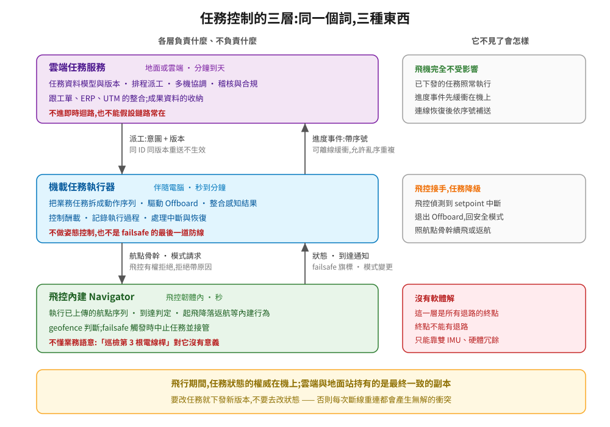
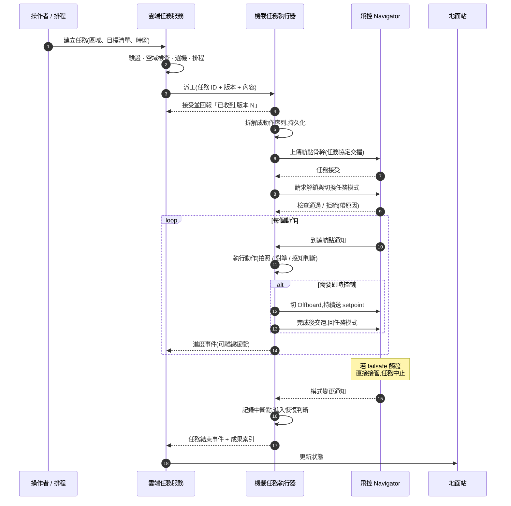

# 任務控制的三層:同一個詞,三種東西

「Mission Controller」這個詞在無人機圈至少指三種不同的東西,而專案裡多數關於責任邊界的爭執,根源就是雙方講的不是同一層:

- 飛控韌體裡執行航點序列的 **Navigator**
- 跑在機上 Linux、把業務任務拆成動作序列的**機載任務執行器**
- 跑在地面或雲端、管理任務生命週期與派工的**雲端任務服務**

這一章先把三層的責任、介面與失效行為定下來,再走一次完整的任務生命週期,看資料實際上怎麼流。後面兩篇分別展開機載與雲端的實作。

---

## 1. 為什麼是三層

不是為了架構好看。三層各自對應一組無法妥協的性質:

| | Navigator(飛控內) | 機載執行器 | 雲端服務 |
|---|---|---|---|
| **必須在鏈路斷掉時仍運作** | 是 | 是 | 否 |
| **需要理解業務語意** | 否 | 是 | 是 |
| **變更頻率** | 極低(改韌體) | 中(改部署) | 高(改服務) |
| **需要跨機、跨時間的資料** | 否 | 否 | 是 |
| **時間尺度** | 秒 | 秒到分鐘 | 分鐘到天 |

把任兩層合併,就會有一組性質衝突:

- **合併 Navigator 與機載執行器**(把業務邏輯寫進韌體)→ 業務規則一改就要重燒韌體並重新驗證。
- **合併機載執行器與雲端服務**(讓雲端直接驅動飛行)→ 鏈路一斷任務就停,而鏈路一定會斷。
- **只有雲端與飛控兩層**(雲端直接下航點)→ 沒有地方放「看到目標再決定下一步」這種需要即時感知的任務邏輯。

所以三層不是分層潔癖,是三組不能同時滿足的約束逼出來的。

---

  

## 2. 各層的責任與不負責

### Navigator:飛控內建的任務執行

**負責**:執行已上傳的航點序列;判斷是否到達;處理起飛、降落、返航這些內建行為;在 geofence 或 failsafe 觸發時中止任務並接管。

**不負責**:不知道任務的業務意義;不會因為看到什麼而改變計畫;不跟外部系統對話。

它的介面是 MAVLink 的任務協定(上傳、下載、設定當前項目、清除)與航點項目的定義。航點項目能表達的東西是有限而固定的:飛到某點、盤旋多久、觸發相機、改變速度、設定感興趣區域。**這個有限集合就是飛控願意承諾的能力邊界。**

**為什麼要用它**:因為它是唯一在鏈路全斷、伴隨電腦當掉時仍然會繼續執行的東西。任務的骨幹放在這裡,系統才有基本的韌性。

### 機載任務執行器

**負責**:接收業務層級的任務;拆解成動作序列;決定何時用航點任務、何時用 Offboard;整合感知結果做即時決策;控制酬載;記錄執行過程;在中斷後恢復。

**不負責**:不做姿態控制;不是 failsafe 的最後防線;不能覆蓋飛控的安全判斷。

它是三層裡**唯一同時懂業務語意又能即時反應**的一層,所以像「飛到電線桿旁邊,用視覺對準,拍五張不同角度的照片,如果模糊就重拍」這種任務,只能放在這裡。

### 雲端任務服務

**負責**:任務的資料模型與生命週期;排程與派工;多機協調;操作紀錄與稽核;跟外部系統(工單、ERP、UTM)整合;成果資料的收納。

**不負責**:不進即時迴路;不假設鏈路存在;不持有飛行中任務的權威狀態。

---

## 3. 一次任務的完整生命週期

幾個關鍵細節藏在這張圖裡:

**第 4 步的回報是必要的。** 派工不是送出去就算數,執行器必須明確回報「我收到了,而且是版本 N」。沒有這個回報,雲端不知道該不該重送,也不知道機上跑的是哪一版。

**第 7 步的航點骨幹是韌性的來源。** 即使執行器之後掛掉,飛控仍然會照著骨幹飛完或返航,而不是停在空中。

**第 10 步的拒絕要帶原因。** 前面講過,pre-arm 拒絕是常態,執行器要把原因往上回報,而不是重試。

**Offboard 是借用,不是常駐。** 需要即時控制時才切進去,做完立刻交還。長時間停在 Offboard 會讓整個任務的韌性依賴於伴隨電腦不當機。

**進度事件可以離線緩衝。** 雲端連不上時事件先存在機上,連上後補送。這是設計內的正常路徑。

---

## 4. 唯一真相來源在哪裡

這是三層架構裡最重要、也最常被弄錯的一條:

> **飛行期間,任務執行狀態的權威在機上。雲端與地面站持有的是副本。**

理由:機上是唯一在鏈路中斷時仍在推進狀態的地方。如果把權威放在雲端,那麼每次斷線重連都會產生衝突——雲端說「你應該在第 3 點」,機上說「我已經在第 7 點了」,而衝突解決邏輯遠比想像中難寫對。

實務上的做法:

- 機上為每個任務維護一個**單調遞增的進度序號**,事件都帶這個序號。
- 雲端接受亂序與重複,以序號決定新舊,**永遠不回頭**。
- 雲端要改變任務內容時,不是改狀態,而是**下發一個新版本的任務**,由機上決定何時接受(通常是在動作邊界)。
- 只有在任務結束、機上回報最終狀態之後,雲端才把它標記為完結。

這套模式在後端很常見:機上是寫入端,雲端是最終一致的讀取端。把它講成這樣,團隊裡的後端工程師立刻就懂了。

---

## 5. 失效矩陣

| 誰掛了 | Navigator | 機載執行器 | 雲端 | 系統整體行為 |
|---|---|---|---|---|
| 雲端不通 | 正常 | 正常,緩衝事件 | ✗ | 任務照跑,成果與進度事後補送 |
| 地面站關閉 | 正常 | 正常 | 正常 | 任務照跑(依 failsafe 設定) |
| 機載執行器當掉 | 正常 | ✗ | 收不到進度 | 飛控照航點骨幹繼續飛或返航;精細動作(拍照、對準)不會發生 |
| 執行器在 Offboard 中當掉 | 偵測到 setpoint 中斷 | ✗ | — | 飛控退出 Offboard,回上一個安全模式 |
| 飛控失效 | ✗ | 失去控制能力 | — | 沒有軟體解;這是雙飛控或硬體冗餘的範疇 |
| 鏈路全斷 | 正常 | 正常 | 收不到 | 任務照跑,依設定續行或返航 |

這張表應該當成驗收清單:**每一列都要能在模擬中重現並驗證。** 故障注入([10 章講過](../10-flight-controller/03-extending-and-testing.md))讓這件事變得可行。

---

## 6. 三層之間的介面契約

| 介面 | 內容 | 誰主導 | 冪等性 |
|---|---|---|---|
| 雲端 → 執行器 | 任務定義(ID + 版本 + 內容 + 約束) | 雲端下發,執行器決定何時接受 | 必須冪等,同 ID 同版本重送不產生副作用 |
| 執行器 → 雲端 | 進度事件、成果索引、異常 | 執行器主導,雲端被動接收 | 帶序號,可重送 |
| 執行器 → 飛控 | 航點骨幹、模式請求、Offboard setpoint | 執行器請求,飛控可拒絕 | 任務上傳是交握式,天然可重試 |
| 飛控 → 執行器 | 狀態、到達通知、模式變更、failsafe 旗標 | 飛控廣播 | 串流,不保證每筆都收到 |

「執行器決定何時接受新版本」值得展開。飛行途中收到任務更新,不能立刻套用——飛機可能正在下降拍照的中途。正確做法是**在動作邊界檢查有沒有待套用的新版本**,有的話在安全的時機切換,並回報「已套用版本 N+1」。

---

## 7. 開源可用的元件

三層的成熟度差很多:

| 層 | 現成程度 | 可用專案 |
|---|---|---|
| Navigator | **完全現成** | PX4 / ArduPilot 內建,不用自己寫 |
| 機載執行器 | **半現成** | MAVSDK(動作原語)、[Aerostack2](https://github.com/aerostack2/aerostack2)(behavior 為單位的任務組合)、[AirStack](https://github.com/castacks/AirStack)、`px4-ros2-interface-lib`(需要客製飛行模式時) |
| 雲端服務 | **幾乎要自己寫** | [ADOS Mission Control](https://github.com/altnautica/ADOSMissionControl)(GPL-3.0,可當架構參考)、[InterUSS DSS](https://github.com/interuss/dss)(空域協調的標準實作)、一般的後端框架 |

雲端這層沒有現成品的原因很直接:**任務語意跟客戶流程綁得太緊。** 巡檢、測繪、物流、安防的任務資料模型差異大到無法共用。能共用的是底下的通訊、排程、稽核機制,那些用一般後端技術就能解決。

所以合理的投資分配是:Navigator 完全不碰,機載執行器盡量用現成框架加上自己的業務動作,雲端這層自己寫但用成熟的後端技術。

---

## 8. 這一章的結論

1. 「任務控制」在三層有三種意思,多數邊界爭執來自沒對齊在講哪一層。
2. 三層對應三組不能同時滿足的約束:斷線續行、理解業務、變更頻率。
3. 航點骨幹放在飛控是韌性的來源;Offboard 是借用,做完就交還。
4. 飛行期間任務狀態的權威在機上,雲端是最終一致的副本;要改任務就下發新版本,不要改狀態。
5. 失效矩陣的每一列都要能在模擬中重現並驗證。
6. Navigator 完全現成,機載執行器半現成,雲端服務幾乎都要自己寫——因為任務語意跟客戶流程綁得太緊。

→ [02 機載任務執行器怎麼寫](02-onboard-executor.md)
