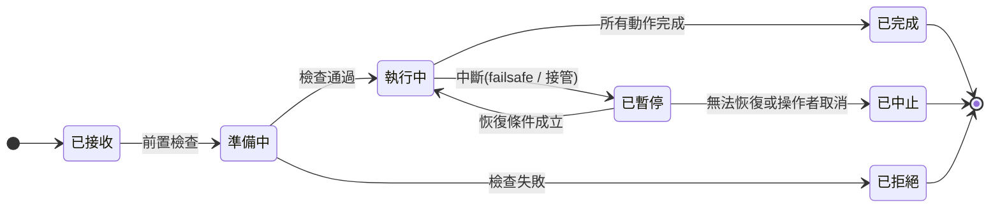

# 機載任務執行器:狀態機、中斷與恢復

機載任務執行器是三層裡最需要真的動手寫的一層,而且它的難處不在「怎麼讓飛機飛到某個點」——那是一行 SDK 呼叫。難處在**中斷**:飛到一半電量低了、操作者接管了、視覺判斷失敗了、執行器自己重開了。每一種中斷之後,系統要回到一個明確定義的狀態,而不是「看起來還在跑但其實已經亂了」。

這一章給一套能撐住這些情況的結構。設計原則只有一條:**假設每一個動作都會在任意時刻被打斷。**

---

## 1. 核心抽象:動作,不是航點

直覺的寫法是把任務寫成一串航點,然後照順序送給飛控。這在「只是飛過去」的任務可以,一旦任務包含「到了之後做點什麼」就會崩壞:航點沒有辦法表達「拍照失敗要重拍」「找不到目標要繞一圈」。

所以執行器的基本單位是**動作**(action),不是航點。一個動作是一段有前置條件、有完成判定、可以被中止、有明確恢復策略的工作。

```python
class Action(Protocol):
    name: str

    def preconditions(self, ctx: Context) -> Check:
        """執行前檢查:電量夠嗎、位置估計有效嗎、酬載就緒嗎。
        不過就不要開始,而不是開始了再失敗。"""

    async def execute(self, ctx: Context) -> None:
        """實際執行。必須能被取消(cancellation)。"""

    def is_complete(self, ctx: Context) -> bool:
        """完成判定要看實際狀態,不要看『我送出指令了』。"""

    async def on_abort(self, ctx: Context, reason: AbortReason) -> None:
        """中止時的收尾:關快門、把雲台歸位、釋放 Offboard。
        這個方法不能失敗,也不能耗時太久。"""

    resume_policy: ResumePolicy   # RESTART | CONTINUE | SKIP
```

每個方法都對應一個具體的失敗經驗:

**`preconditions` 存在,是因為在空中發現條件不足的代價比在地面高得多。** 電量只夠飛一半的任務,應該在起飛前就拒絕,而不是飛到一半才返航。

**`is_complete` 要看實際狀態,不要看送出的指令。** 「我送了拍照指令」跟「照片存在儲存卡上」是兩件事。完成判定看前者,你會得到一個成功率報告很漂亮但實際上少了三成照片的系統。

**`on_abort` 不能失敗。** 它是在已經出事的路徑上跑的,如果它自己也會拋例外,系統就沒有乾淨的退場方式。裡面只放冪等、不需要外部條件的收尾動作。

**`resume_policy` 是每個動作自己的性質,不是全域設定。** 「飛到某點」中斷後重跑就好(CONTINUE);「拍一組環繞照片」要整組重來,因為少了中間幾張這組資料就沒用(RESTART)。把它寫在動作上,恢復邏輯才不用充滿特例。

第三種政策 SKIP(直接跳過不再執行)要非常小心。直覺上「起飛」很適合 SKIP——已經在空中了還起飛什麼?但這個直覺假設了**中斷發生在動作完成之後**。實際上中斷可能打在起飛途中,這時飛機還在地面;跳過起飛之後,下一個 `goto` 就會在「以為已經在空中」的錯誤前提下執行,被飛控直接拒絕。

正確的做法是讓起飛用 CONTINUE,**把冪等性放在動作裡**:`execute` 進來先看實際狀態,已經在空中就跳過內部步驟。SKIP 只留給「絕不可重複」的動作,例如投放貨物——而即使是那種情況,更好的解法通常是讓動作自己去查「貨還在不在」,而不是靠恢復政策猜。

([`reference-impl/`](../../reference-impl/) 一開始就是照直覺寫成 SKIP 的,恢復測試跑出來才發現這件事。)

---

## 2. 兩層狀態機

任務有狀態,動作也有狀態,兩層要分開:



動作層則是:`待執行 → 前置檢查 → 執行中 → 完成 / 中止`。

分開的好處是**恢復時只需要處理動作層**:任務回到「執行中」,然後依照當前動作的 `resume_policy` 決定是重跑、續行還是跳過。如果把兩層混在一起,恢復邏輯會變成一大團 if。

### 進度序號

每次狀態變更都遞增一個單調的序號,所有往上回報的事件都帶著它。這讓雲端可以安全地處理亂序與重複([上一篇](01-three-layers.md)講的最終一致性)。序號要跟狀態一起持久化,執行器重啟後從持久化的值繼續,不能歸零。

---

## 3. 執行迴圈

```python
async def run(mission: Mission, ctx: Context) -> Outcome:
    state = store.load(mission.id) or State.fresh(mission)

    while (action := mission.next_action(state)) is not None:
        if check := action.preconditions(ctx); not check.ok:
            return await abort(mission, state, reason=check.reason)

        state.begin(action); store.save(state); emit(state)

        try:
            async with watch_for_interrupt(ctx):     # 監看 failsafe 與模式變更
                await action.execute(ctx)
                await wait_until(lambda: action.is_complete(ctx), timeout=action.timeout)

        except Interrupted as e:
            await action.on_abort(ctx, e.reason)
            state.pause(e.reason); store.save(state); emit(state)
            if not await wait_for_resume(ctx):
                return await abort(mission, state, reason=e.reason)
            state.resume(action.resume_policy)       # RESTART / CONTINUE / SKIP
            continue

        state.complete(action); store.save(state); emit(state)

    return Outcome.completed(state)
```

三個容易寫錯的地方:

**每次狀態變更都先存檔再發事件。** 反過來的話,發完事件就當機,雲端會以為某個動作完成了,而機上重啟後不知道。存檔在前,事件在後,重複的事件靠序號去重。

**中斷監看要跟動作執行同時進行,而不是在動作之間檢查。** 一個「飛到某點」的動作可能執行三分鐘,如果只在動作邊界檢查中斷,那三分鐘內 failsafe 觸發了執行器也不知道。

**逾時是每個動作自己的。** 沒有逾時的動作會讓整個任務永遠卡住;統一的全域逾時又會誤殺本來就慢的動作。

---

## 4. Offboard 的正確用法

需要即時控制(視覺對準、精準降落、跟隨)時才切 Offboard,而且要當成**借用**:

```
1. 先以固定頻率(建議 ≥ 20 Hz,遠高於飛控要求的下限)送 setpoint
2. 確認飛控收到之後,才請求切換到 Offboard
3. 檢查切換結果的回覆,拒絕就走中止路徑,不要重試迴圈
4. 執行期間持續送,不能有空窗
5. 完成後把模式切回任務模式,再停止送 setpoint
```

第 1 步的「先送再切」在[00 章](../00-system-overview/01-the-control-loop.md)解釋過它擋住什麼:避免出現「歸外部控制但外部還沒說話」的真空狀態。

第 5 步的順序常被寫反:先停送再切模式,中間那一小段會被飛控判定為 Offboard 失聯,觸發不必要的模式退出。

還有一條實務規則:**送 setpoint 的迴圈要獨立於任務邏輯的迴圈。** 如果任務邏輯裡有一次比較慢的運算(例如一次推論)導致 setpoint 晚送了 500 毫秒,飛控就會退出 Offboard。正確作法是一個高頻執行緒只負責送最新的 setpoint,任務邏輯只負責更新那個值。

---

## 5. 三種中斷與各自的恢復

| 中斷來源 | 特徵 | 恢復策略 |
|---|---|---|
| **飛控 failsafe** | 飛控已經接管,模式被改變 | 不能對抗。記錄中斷點,等飛控行為結束(返航完成、降落完成)後,由操作者或雲端決定要不要續飛 |
| **操作者接管** | 遙控器或地面站切了模式 | 立即讓出控制,進入暫停;操作者交還控制後才詢問是否恢復 |
| **執行器自己重啟** | 行程沒了,飛機還在飛 | 從持久化狀態恢復;**先確認飛機當前實際狀態**,再決定續行 |

第三種最需要小心。執行器重啟後,不能假設飛機還在中斷時的位置——它可能已經照著航點骨幹飛了兩公里。正確流程是:讀取持久化狀態 → 讀取飛控的當前模式與位置 → 比對兩者 → 依差異決定是續行、重新規劃,還是進入安全狀態等指令。

**跳過中間那一步直接續行,是這個領域最危險的 bug 之一**:程式以為飛機在 A 點,實際上在 B 點,然後開始執行「從 A 點下降到 3 公尺」。

---

## 6. 與 failsafe 的關係:配合,不對抗

執行器**永遠不能**做這幾件事:

- 用重試迴圈對抗被拒絕的模式切換
- 在低電量 failsafe 觸發後試圖切回任務模式
- 用外部指令覆蓋 geofence 的行為
- 把 failsafe 的門檻設得比自己的邏輯還鬆,好讓自己的邏輯先生效

正確的協作方式是**執行器比 failsafe 更早介入**:飛控的低電量門檻是最後防線,執行器應該有自己更保守的門檻,在還有餘裕時主動結束任務返航。這樣 failsafe 就永遠不會被觸發,而它仍然在那裡當保險。

這是很通用的模式:**讓保護機制成為「不應該發生的事」,而不是「正常流程的一部分」。** 如果你的系統每次任務都會觸發 failsafe,那不是 failsafe 好用,是任務邏輯有問題。

---

## 7. 怎麼讓它可測試

執行器要能在 SITL 裡自動測,關鍵是把幾個東西抽出來:

**時間要可注入。** 不要直接呼叫系統時鐘與 sleep,包一層。這樣測試可以快轉,一個十分鐘的任務在測試裡幾秒跑完。

**飛控介面要可替換。** 定義一個介面(切模式、送 setpoint、上傳任務、讀狀態),真實實作接 MAVSDK 或 ROS 2,測試實作是可控的假物件。單元測試用假物件驗狀態機,整合測試接真的 SITL。

**中斷要可注入。** 測試要能在任意時間點注入 failsafe、模式變更、行程重啟,然後斷言系統回到正確狀態。

**持久化要可檢查。** 恢復測試的做法是:跑到一半殺掉行程 → 用同一份持久化狀態重新啟動 → 斷言它做出正確的恢復決定。

有了這四項,執行器的行為就變成確定性可測的,而不是「飛飛看」。這是把這個領域拉進正常軟體工程的關鍵一步。

---

## 8. 常見錯誤

| 錯誤 | 後果 |
|---|---|
| 完成判定看指令送出而非實際狀態 | 成功率報告失真 |
| 只在動作邊界檢查中斷 | 長動作期間對 failsafe 沒有反應 |
| 恢復時不先確認飛機實際狀態 | 用過期的位置假設執行動作 |
| setpoint 送在任務邏輯的同一個迴圈裡 | 一次慢運算就掉出 Offboard |
| 對被拒絕的模式切換做重試迴圈 | 掩蓋真正的原因,而且可能跟 failsafe 打架 |
| 進度只存在記憶體 | 重啟後從頭開始或完全迷失 |
| 事件先發後存 | 雲端狀態超前機上,重啟後不一致 |
| 全域統一逾時 | 慢動作被誤殺,快動作卡住不被發現 |

---

## 9. 這一章的結論

1. 基本單位是動作不是航點,因為航點表達不了「到了之後做什麼、失敗了怎麼辦」。
2. 動作的五個方法各對應一個具體的失敗經驗;恢復策略屬於動作本身,不是全域設定。
3. 任務與動作兩層狀態機分開,恢復時只處理動作層。
4. 狀態變更先存檔再發事件;中斷監看與動作執行同時進行;逾時是每個動作自己的。
5. Offboard 是借用:先送再切、切回再停;送 setpoint 的迴圈要獨立於任務邏輯。
6. 執行器不對抗 failsafe,而是設更保守的門檻讓 failsafe 永遠不被觸發。
7. 時間、飛控介面、中斷、持久化四者可注入可替換,執行器就變成確定性可測。

→ [03 雲端任務服務](03-cloud-mission-service.md)
