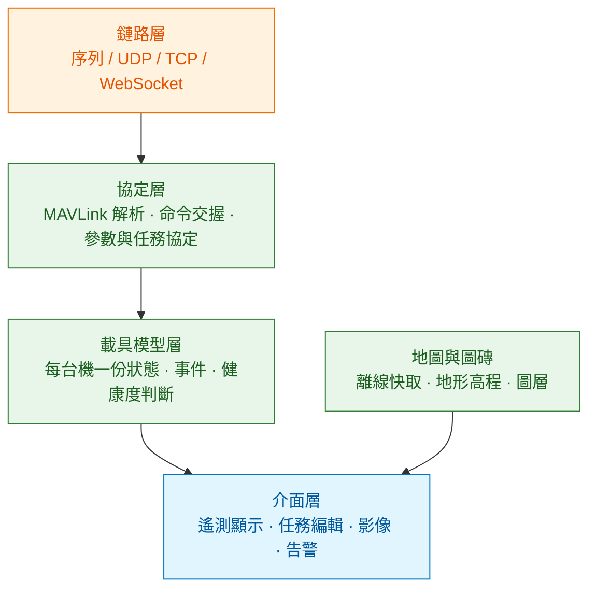

# 地面站:一個被低估的即時前端

地面站看起來就是「一張地圖加一些數字」,實際上它是這套系統裡**唯一直接影響人類決策的元件**。操作者要在幾秒內判斷「這台機現在安不安全」,而判斷的依據全部來自這個介面。介面設計錯了,不是體驗差,是會出事。

這一章談三件事:GCS 的架構長什麼樣、自研的界線在哪、以及幾個攸關安全的介面設計原則。

---

## 1. 架構:四個子系統

不論桌面版還是 web 版,GCS 都會分成這四塊:

分層的價值在於**協定層與介面層要能各自演進**。實務上最常見的糟糕設計是把 MAVLink 解析直接寫在畫面元件裡,結果換一個顯示方式就要動協定程式碼,而且沒辦法單獨測試。

載具模型層是這裡最容易被忽略的一層。它不只是存最後收到的值,還要負責:

- **判斷資料新不新**。每個欄位要記「最後更新時刻」,超過門檻就標成失效,而不是繼續顯示舊值。
- **判斷連線狀態**。心跳超時、掉包率、鏈路品質。
- **把原始欄位翻成健康度**。使用者要看的是「GPS 可用 / 精度不足 / 無定位」,不是原始的定位型別代碼。

---

## 2. 自研的界線

[選型那章](../05-open-source-landscape/02-selection.md)給過結論,這裡補上理由。

現成的 GCS(QGroundControl、Mission Planner)已經累積十幾年的機型細節與硬體怪癖:各廠牌感測器的校正流程、不同韌體版本的參數差異、韌體燒錄的各種例外、機型設定精靈。這些東西沒有技術含量但量極大,重做一遍是純粹的浪費。

值得自研的是**現成 GCS 結構上做不到的事**:

| 自研 | 因為 |
|---|---|
| 多機隊的總覽與排程 | 現成 GCS 是單機工具,不是機隊平台 |
| 跟工單、ERP、客戶系統整合 | 業務流程綁定,沒有通用解 |
| 給非技術操作者的簡化介面 | 現成 GCS 的目標使用者是懂飛控的人 |
| 遠端監控(操作者不在現場) | 現成 GCS 假設你就在機旁邊 |
| 客製酬載的操作介面 | 廠商特有,不會進上游 |

**分工的正解是:現場的機器設定與校正用 QGC,營運與監控用自研平台,兩者透過資料層整合。** 不要試圖在自研平台裡重做參數校正——那是最花時間又最不可能做得比較好的部分。

### Web GCS 的額外考量

自研通常會選 web。要注意幾件事:

- **影像要走 WebRTC**,其他協定進不了瀏覽器([影像那章](../30-companion-compute/02-video-and-perception.md)講過)。
- **地圖圖磚的授權與離線**。多數線上地圖服務的條款不允許快取,而現場常常沒網路。要嘛用允許離線的資料源,要嘛買授權。
- **瀏覽器不是即時環境**。分頁被切到背景時,計時器會被節流,動畫會停。任何依賴前端計時的邏輯(例如「三秒沒收到就告警」)都要考慮這件事,或乾脆放到後端做。
- **控制權限要在後端把關**。前端的按鈕禁用只是提示,真正的權限檢查必須在後端,因為前端是使用者可以改的。

---

## 3. 攸關安全的介面設計

這幾條是從事故經驗累積出來的,不是美學偏好:

**當前模式必須永遠可見,而且要顯眼。** 大量的事故起於「操作者以為飛機在某個模式」。模式變更要有明確的視覺與聲音提示,尤其是**非操作者主動觸發的變更**(failsafe 介入)。

**資料失效要看得出來。** 位置資料停止更新時,顯示「位置資料已過期 8 秒」比繼續顯示最後一個位置安全得多。最糟的設計是畫面上有一個看起來正常的位置,實際上那是十秒前的。

**危險操作要有阻力,但不能有太多阻力。** 解鎖、切模式、中止任務要有確認;但緊急中止不能藏在三層選單裡。判準是:**這個操作出錯的代價 vs 慢一秒的代價**。

**告警要分級而且要能收斂。** 所有告警都同一個紅色,結果就是操作者對紅色免疫。低電量提醒與失控警報必須看起來完全不同。同一個原因造成的一連串告警要合併,不要洗版。

**顯示的數字要有單位與座標系。** 高度是海拔還是相對起飛點?這兩個在山區差幾百公尺。介面上不寫清楚,遲早會有人搞錯。

**不要用動畫平滑掉真實的抖動。** 插值讓畫面好看,但也會把「姿態在震盪」這個重要訊號抹掉。監控介面應該忠實呈現,平滑留給展示用的視圖。

---

## 4. 遙測顯示的更新率

一個常見的誤解是「更新率越高越好」。實際上:

| 用途 | 合理更新率 | 理由 |
|---|---|---|
| 姿態指示 | 5~10 Hz | 人眼判讀的上限就在這附近 |
| 位置與地圖 | 2~5 Hz | 地圖移動更快反而難讀 |
| 電量、模式、狀態 | 1 Hz | 變化慢 |
| 告警 | 事件驅動 | 不要等下一個週期 |
| 影像 | 25~30 fps | 這是唯一需要高幀率的 |

拉高遙測頻率的代價是[頻寬](../20-protocols/02-routing-and-bandwidth.md),而收益接近零。**要看高頻資料應該從機上的飛行紀錄取得,不是從鏈路要。**

---

## 5. 多機視圖的設計

管十台機跟管一台機是不同的問題。單機介面的資訊密度直接乘以十會變成沒人看得懂的儀表板。

比較有效的做法:

- **預設顯示例外,不顯示全部。** 正常的機器只需要一個小圖示,有問題的才展開。
- **要有一個明確的「注意力排序」。** 誰最需要人介入?依嚴重度與剩餘時間排序,而不是依機器編號。
- **從總覽到單機要能一鍵下鑽**,而且下鑽之後的介面就是單機介面,不要另外設計一套。
- **狀態摘要要能一眼掃完。** 十台機的狀態應該用一行顏色條就能看出「三台在飛、一台告警、六台待命」。

---

## 6. 這一章的結論

1. GCS 分成鏈路、協定、載具模型、介面四層;載具模型層負責資料新鮮度與健康度判斷,最常被忽略。
2. 現成 GCS 的價值在十幾年累積的機型細節,重做是浪費;自研的價值在機隊、整合、遠端與客製酬載。
3. 介面設計的安全原則:模式永遠可見、失效要看得出來、危險操作有阻力但不能太多、告警分級收斂、數字帶單位與座標系。
4. 遙測更新率拉高幾乎沒有收益,高頻資料應該從機上紀錄取得。
5. 多機視圖要顯示例外而非全部,並提供明確的注意力排序。

→ [02 機隊營運與資料治理](02-fleet-and-data.md)
