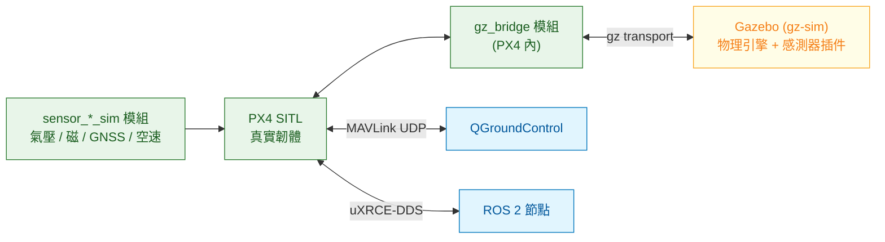

# Gazebo 與 Isaac Sim:各自解決什麼問題

這兩個工具經常被拿來比較,但它們其實在回答不同的問題。Gazebo 問的是「**這套系統的行為對不對**」,Isaac Sim 問的是「**這個感測器看到的畫面夠不夠真**」。搞清楚這個差別,選擇就不用糾結了。

版本現況見 [CONTEXT.md](../../CONTEXT.md);以下講架構與取捨。

---

## 1. Gazebo:PX4 的預設模擬環境

### 怎麼接起來的



PX4 端有一個 `gz_bridge` 模組負責跟 Gazebo 交換狀態與致動器指令,另外有一組 `sensor_baro_sim`、`sensor_mag_sim`、`sensor_gps_sim`、`sensor_airspeed_sim` 模組產生模擬的感測器讀值。**注意這些是 PX4 內部的模組**——也就是說模擬的感測器資料是從韌體內部注入的,走的是跟真實驅動同一條路徑進 uORB。

啟動方式是選一個模擬機型:

```bash
make px4_sitl gz_x500              # 基本四旋翼
make px4_sitl gz_x500_depth        # 帶深度相機
make px4_sitl gz_x500_gimbal       # 帶雲台
make px4_sitl gz_x500_lidar_2d     # 帶二維光達
make px4_sitl gz_standard_vtol     # VTOL
make px4_sitl gz_rover_differential # 差速輪型載具
```

(機型清單取自 PX4 main 分支的模擬機型定義。)

### 它的優勢

**啟動快、資源少、可無頭執行。** 這三點加起來就是「可以放進 CI」。一個 CI 節點可以同時跑好幾個實例。

**跟 PX4 對齊。** PX4 官方的整合測試就跑在上面,版本相容性有人維護。

**物理夠用。** 剛體動力學、碰撞、關節、簡單的空氣動力都有。對驗證控制與任務邏輯來說綽綽有餘。

### 它的限制

相機影像是傳統的光柵渲染,材質、光照、陰影都是近似。拿來驗證「相機能不能看到某個標記」可以,拿來訓練或驗證需要真實光學特性的視覺演算法(反光、逆光、動態範圍、鏡頭效應)就不夠。

---

## 2. Isaac Sim:當畫面本身就是待驗的東西

### 定位

Isaac Sim 建立在 USD 場景描述與 PhysX 物理引擎之上,用 RTX 做光線追蹤渲染。對無人機來說,它的核心價值是**感測器保真度**:

- 光線追蹤的相機影像,含真實的反射、折射、陰影、景深
- 可模擬鏡頭畸變、感測器雜訊、動態範圍
- 光達與深度相機的物理模型
- GPU 平行,可以同時跑大量實例產生訓練資料

所以它適合的問題是:視覺演算法在特定光照下會不會失效、深度估計在玻璃帷幕前的表現、要生十萬張標註影像來訓練模型、強化學習需要大量平行環境。

### 怎麼接 PX4

Isaac Sim 本身不知道 PX4 的存在,需要橋接。開源的方案是 [Pegasus Simulator](https://github.com/PegasusSimulator/PegasusSimulator):它在 Isaac Sim 裡建立多旋翼的動力學模型,把狀態送給 PX4、把致動器指令收回來,並提供 ROS 2 介面。

要注意的兩件事:

**版本綁定很緊,而且目前落後一個大版本。** Pegasus 每個版本都明示與舊版 Isaac Sim 不相容,最新的 v5.1.0 對應 Isaac Sim 5.1。Isaac Sim 6.0 已於 2026-06-04 GA,但 Pegasus 在上面載入失敗——相依於 6.0 移除的 `omni.isaac.core`([issue #131](https://github.com/PegasusSimulator/PegasusSimulator/issues/131),查證日 2026-08-05 仍未關閉)。**要用 Pegasus 就得停在 Isaac Sim 5.1。** 版本對應見 [CONTEXT.md](../../CONTEXT.md)。

**授權不是單純的開源。** Isaac Sim 的原始碼是 Apache-2.0,但它依賴的 Omniverse Kit SDK 與 3D 資產另有 NVIDIA 授權,而且需要 NVIDIA GPU。[生態地圖那章](../05-open-source-landscape/01-landscape.md)有詳細說明。

---

## 3. 對照

| | Gazebo | Isaac Sim |
|---|---|---|
| 主要價值 | 系統行為的可重複驗證 | 感測器與視覺的保真度 |
| 物理 | 剛體 + 簡化空氣動力,夠用 | PhysX,較細緻 |
| 相機 | 光柵渲染,近似 | 光線追蹤,接近真實 |
| 啟動時間 | 秒級 | 數十秒到分鐘級 |
| 硬體需求 | CPU 即可,GPU 加分 | **必須有 NVIDIA GPU** |
| 無頭執行 | 原生支援 | 支援,但仍需 GPU |
| 單機平行實例 | 多 | 少(受 GPU 記憶體限制) |
| PX4 整合 | 官方主線 | 透過 Pegasus,社群維護 |
| 授權 | Apache-2.0 | Apache-2.0 + NVIDIA 元件授權 |
| 適合 CI | **是** | 成本高,選擇性使用 |

---

## 4. 混合策略

實務上兩個都用,但分工明確:

```
每次提交       → Gazebo,無頭,跑核心情境(數十個,幾分鐘)
每晚           → Gazebo,跑完整情境矩陣(含故障注入)
每週 / 里程碑  → Isaac Sim,跑視覺相關的情境
改視覺演算法時 → Isaac Sim,跑光照與場景的變化組合
上真機之前     → SIH / HITL,補時序與 CPU 負載
```

判準就是[前一篇](01-what-simulation-proves.md)那張外推表:**要驗的東西如果不依賴影像保真度,就用 Gazebo,因為它便宜十倍。**

一個常見的錯誤是因為 Isaac Sim 的畫面漂亮就把整個驗證系統建在上面。結果是 CI 跑一次要二十分鐘、需要 GPU 機器、平行度上不去,團隊很快就不跑了——**一個沒人跑的 CI 等於沒有 CI。**

---

## 5. 實務上會踩的坑

**時間同步。** 模擬用的是模擬時間,ROS 2 節點預設用系統時鐘。忘記設定使用模擬時間會讓所有跟時間相關的邏輯錯亂,而且症狀難以解讀。這是接 ROS 2 時最常見的第一個坑。

**模擬速度與真實時間。** 模擬可能跑得比真實快或慢。測試裡的等待要用模擬時間,不要用系統的睡眠。

**確定性。** 想要每次結果完全一致,需要固定隨機種子並確認物理引擎的步進是確定的。有些設定(多執行緒物理、GPU 渲染)會引入不確定性,做回歸測試時要注意。

**GPU 資源。** 在 CI 節點上跑 Isaac Sim,要規劃 GPU 的排隊與隔離,否則兩個測試互搶顯示記憶體會一起失敗。

**版本組合。** PX4 版本 × ROS 2 distro × Gazebo 版本 × 模擬器橋接版本,這四個維度的組合不是每一種都能用。把可用的組合鎖進建置設定,不要讓每個開發者自己試。

**地面效應與碰撞。** 模擬的地面接觸模型常常過於理想。降落與起飛階段的行為要特別小心,模擬過了不代表真機的降落穩。

---

## 6. 這一章的結論

1. Gazebo 驗系統行為,Isaac Sim 驗感測器保真度,兩者回答的是不同問題。
2. PX4 用 `gz_bridge` 模組與一組 `sensor_*_sim` 模組接 Gazebo,模擬資料從韌體內部注入 uORB。
3. Isaac Sim 透過 Pegasus Simulator 接 PX4,版本綁定緊,而且授權不是單純開源、需要 NVIDIA GPU。
4. CI 建在 Gazebo 上,Isaac Sim 用於視覺相關的定期驗證;把 CI 建在 Isaac Sim 上會讓它慢到沒人跑。
5. 常見的坑:模擬時間沒設定、測試用系統睡眠、確定性設定、GPU 排隊、版本組合。

要拿模擬來**訓練**策略而不只是驗證,需求會完全不同(吞吐、隨機化、GPU 平行),而且堆疊也不一樣——見 [65 Physical AI 模擬環境](../65-physical-ai-sim/)。

→ [03 建一套自動化驗證系統](03-ci-and-regression.md)
