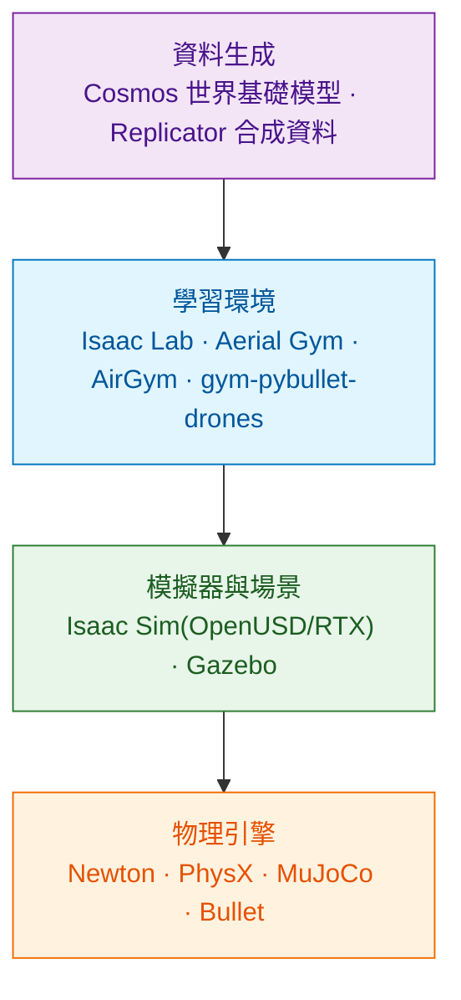

# Physical AI 模擬環境:訓練用的模擬跟驗證用的不一樣

[60 章](../60-simulation-and-testing/)講的模擬是為了**驗證**——擋住回歸、重現故障、證明改動沒有弄壞東西。這一章講的模擬是為了**訓練**——把一個策略學出來。

兩者的需求幾乎正交,而混為一談是建環境時最貴的錯誤:

| | 驗證用模擬 | 訓練用模擬 |
|---|---|---|
| 最重要的性質 | **確定性**,同輸入同輸出 | **吞吐量**,每秒能跑多少步 |
| 平行度 | 幾個實例就夠 | 數千到數萬個環境同時跑 |
| 隨機性 | 要能關掉,或至少固定種子 | 要刻意加,而且要夠廣 |
| 感測器保真 | 夠用就好 | 看訓什麼,視覺任務要很高 |
| 硬體 | CPU 就能跑 | 幾乎一定要 GPU |
| 成功的定義 | 斷言通過 | 策略在**沒見過的**條件下還能用 |

一句話:**驗證環境要像你的系統,訓練環境要比真實世界更多變。** 用訓練環境當驗證環境,等於拿考古題當模擬考;用驗證環境訓練,吞吐量會低到訓不完。

以下的版本與授權以 `gh api` 於 2026-08-05 查證。

---

## 1. 堆疊有四層

多數人只看到中間兩層,但最上與最下這兩層在 2026 都剛發生大變化。

---

## 2. 2026 的現況

| 層 | 專案 | 授權 | 最後推送 | Stars | 定位 |
|---|---|---|---|---|---|
| 物理 | [Newton](https://github.com/newton-physics/newton) | Apache-2.0 | 2026-08-04 | 5.3k | GPU 物理引擎,建在 Warp + OpenUSD 上 |
| 物理 | [MuJoCo Warp](https://github.com/google-deepmind/mujoco_warp) | Apache-2.0 | 2026-08-04 | 1.4k | Newton 的主要 backend |
| 底層 | [NVIDIA Warp](https://github.com/NVIDIA/warp) | Apache-2.0 | 2026-08-04 | 6.9k | Python 寫 GPU kernel 的框架 |
| 學習 | [Isaac Lab](https://github.com/isaac-sim/IsaacLab) | BSD-3-Clause | 2026-08-05 | 7.8k | 建在 Isaac Sim 上的統一機器人學習框架 |
| 學習 | [Aerial Gym Simulator](https://github.com/ntnu-arl/aerial_gym_simulator) | BSD-3-Clause | 2026-06-28 | 751 | 專做多旋翼的大規模平行訓練 |
| 學習 | [AirGym](https://github.com/emNavi/AirGym) | BSD-3-Clause | 2026-08-04 | 169 | 另一套建在 Isaac Gym 上的無人機 DRL 平台 |
| 學習 | [gym-pybullet-drones](https://github.com/utiasDSL/gym-pybullet-drones) | MIT | 2026-07-11 | 2.1k | CPU 也能跑,入門與教學的首選 |
| 整合 | [aerial-autonomy-stack](https://github.com/JacopoPan/aerial-autonomy-stack) | MIT | 2026-08-04 | 551 | Gazebo + PX4/ArduPilot + ROS 2 + 感知 + Jetson 部署 |
| 資料 | [Cosmos Predict 2.5](https://github.com/nvidia-cosmos/cosmos-predict2.5) | Apache-2.0 | 2026-06-08 | 1.3k | 世界基礎模型,生合成影片資料 |

### Newton 1.0 是這半年最值得注意的一件事

2026 年 3 月的 GTC 上,NVIDIA、Google DeepMind、Disney Research 共同發布 **Newton 1.0**,由 Linux Foundation 管理,Apache-2.0。技術上它建在 NVIDIA Warp 與 OpenUSD 之上,把 MuJoCo Warp 當主要的剛體 backend,另外帶可變形體、SDF 碰撞、hydroelastic 接觸模型。

它為什麼重要,對這個領域來說有兩點:

**物理引擎從各家自己搞變成有一個共同底座。** 過去 Isaac 用 PhysX、MuJoCo 自成一格、Gazebo 用 ODE/Bullet,同一個機器人在不同引擎上的行為對不起來。有一個大家都往上接的開源引擎,長期會讓「換模擬器」的成本下降。

**GPU 加速的量級是真的。** 官方數字是 MuJoCo Warp 在 RTX PRO 6000 Blackwell 上,運動任務約為 MJX 的 252 倍、操作任務約 475 倍。這種差距會改變什麼實驗做得起來、什麼做不起來。

要注意的是**它還在整合中**:Isaac Lab 對 Newton 的整合放在 develop 分支、屬於 Isaac Lab 3.0 Beta。現在把它放進生產流程會太早,但值得從現在就跟。

### Isaac Lab 的無人機支援

Isaac Lab 2.3.2(2026-01-30)加入了無人機相關能力。它的核心價值是**大規模平行**:公開的研究裡有用 4,096 個平行環境訓練四旋翼控制策略的做法,而官方也展示過 15 萬 FPS 等級的訓練吞吐。

---

## 3. 四套無人機學習環境怎麼選

| | Aerial Gym | AirGym | gym-pybullet-drones | Isaac Lab |
|---|---|---|---|---|
| 底座 | Isaac Gym(Preview) | Isaac Gym(Preview) | PyBullet | Isaac Sim |
| 硬體門檻 | NVIDIA GPU | NVIDIA GPU | **CPU 可跑** | NVIDIA GPU(較高) |
| 平行度 | 數千 | 數千 | 低 | 數千以上 |
| 感測器 | GPU ray-cast 的 LiDAR / 相機 | 有 | 基本 | RTX 等級 |
| 上手成本 | 中 | 中 | **低** | 高 |
| 適合 | 低階控制、視覺導航 | 低階控制 | 教學、演算法原型 | 需要高保真感測器的任務 |

Aerial Gym 官方宣稱**狀態式控制策略一分鐘內訓完、視覺導航策略一小時內訓完**,對「先跑起來看看」很有吸引力。

### 一個必須知道的世代問題

**Aerial Gym 與 AirGym 目前都建在 Isaac Gym 上,而 Isaac Gym 是 NVIDIA 已經停止推進的 Preview 版本,官方方向是 Isaac Lab。** Aerial Gym 的文件寫著「Isaac Lab 與 Isaac Sim 支援開發中」,但截至查證日尚未完成。

這件事對選型的意思是:

- 要**快速做研究、跑實驗**:用 Aerial Gym 沒問題,它現在最省事。
- 要**建一個要維護三年的產線**:直接押 Isaac Lab,即使一開始要多寫一些環境程式碼。押在 Isaac Gym 上的東西,遷移是遲早的事。
- 完全不想碰 GPU 或只是要教學:gym-pybullet-drones,MIT 授權、CPU 可跑,而且它是這幾套裡文件最完整的。

### aerial-autonomy-stack:少數把整條路打通的

這個專案值得單獨提,因為它處理的正是「訓練完之後呢」:Gazebo Sim 跑 PX4 與 ArduPilot 的多機模擬(四旋翼、VTOL、tailsitter),ROS 2 Humble,感知端接 YOLO(ONNX GPU Runtime)與 KISS-ICP 光達里程計,部署端支援 Jetson 的容器化 JetPack,而且提供**可步進的 Gymnasium 環境與快於真實時間的多實例模擬**。

它的價值不在單一元件有多強,而在**同一套東西能從訓練跑到真機**,不必在中間換三次框架。MIT 授權。

---

## 4. 資料生成這一層

Cosmos 這類世界基礎模型解決的是另一個問題:**不是「怎麼訓」,是「哪來的資料」。**

Cosmos Predict 2.5 把 Text2World、Image2World、Video2World 統一在一個 flow-based 模型裡,以 2B 與 14B 兩種規模釋出,Apache-2.0。用途是生成大量物理環境的擬真影片,拿來訓練感知模型,省掉實地收資料。

對無人機的直接應用場景:巡檢目標在不同天候、光照、季節下的外觀變化。真的去拍要跑一年,生成的話可以在幾天內覆蓋。

**但這一層的門檻很高**:官方說明影片類世界基礎模型需要每張 GPU 至少 80 GB VRAM,7B 級可在單張 H100 80GB 上跑,14B 級要多卡。這不是一般開發機的等級。

務實的建議:**先把前三層打通,資料生成這一層等你真的卡在「資料不夠」再說。** 多數團隊卡住的地方是環境跑不起來或 sim-to-real 過不去,不是資料量。

---

## 5. 硬體門檻

按你要做的事情估:

| 目標 | 最低配置 | 說明 |
|---|---|---|
| 學 RL、跑 gym-pybullet-drones | 一般開發機 | CPU 可跑 |
| 訓狀態式控制策略(Aerial Gym / AirGym) | 單張消費級 NVIDIA GPU | 數千平行環境,不需要渲染 |
| 訓視覺導航策略 | 單張較高階 GPU,VRAM 越大越好 | 要同時跑渲染與訓練 |
| Isaac Lab + Isaac Sim 完整流程 | 工作站級 GPU | 場景與 RTX 感測器吃資源 |
| Cosmos 生成合成資料 | **80 GB VRAM 起跳** | 14B 級要多卡 |

一個常被低估的成本:**VRAM 通常比算力先成為瓶頸。** 平行環境數 × 每個環境的觀測大小(尤其是影像)會直接吃掉顯示記憶體,而降平行度就等於降訓練吞吐。

---

## 6. 這一章的結論

1. 訓練用模擬與驗證用模擬的需求正交:前者要吞吐與隨機,後者要確定與可重播。兩者要分開建。
2. 堆疊分四層(物理、模擬器、學習環境、資料生成),2026 的大變化發生在最上與最下兩層。
3. Newton 1.0 讓 GPU 物理有了共同的開源底座,但 Isaac Lab 的整合仍在 Beta,現在跟進但別押生產。
4. 四套無人機學習環境按硬體門檻與維護年限選;Aerial Gym 最省事但建在已停止推進的 Isaac Gym 上,長期產線押 Isaac Lab。
5. aerial-autonomy-stack 的價值在同一套東西能從訓練跑到 Jetson 真機,不必中途換框架。
6. 資料生成層門檻在 80 GB VRAM 起跳,而多數團隊卡住的地方不是資料量,是 sim-to-real——先把前三層打通。

→ [02 從訓練到上機:策略要放在哪一層](02-sim-to-real.md)
