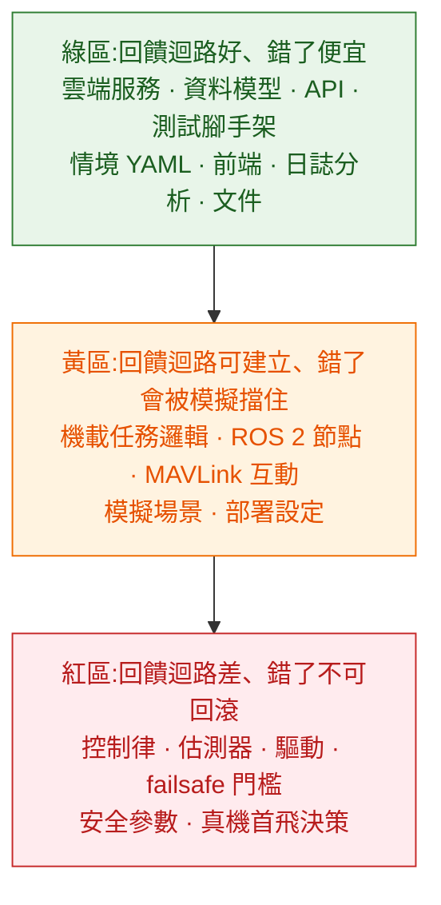

# AI 工具在無人機開發裡的能力邊界

用 AI 工具寫程式的效益,取決於**回饋迴路的品質**:改完能不能馬上知道對不對。這個判準套到無人機領域會得到一個不太舒服的結論——這個領域的回饋迴路預設是很差的:啟動一次模擬要幾十秒,真機驗證要開車去空地,而錯誤的代價是摔掉一台幾十萬的機器。

所以問題不是「AI 能不能寫無人機程式」,而是**哪些部分的回饋迴路夠好,好到可以放心讓 AI 產出並快速驗證**。這一章給一張分區表與各區的理由。

---

## 1. 三個區域

### 綠區:直接用,產出當一般程式碼審

雲端任務服務、資料模型、REST API、事件處理、前端、測試腳手架、情境定義、飛行紀錄的分析腳本、文件。

這些跟一般後端與前端工作沒有本質差別:有單元測試、有型別檢查、錯了重跑一次就好。AI 在這裡的效益跟在其他專案一樣,不需要特別的顧慮。

值得特別提的是**飛行紀錄分析**。ULog 裡有幾十個主題、上百個欄位,寫分析腳本很瑣碎但邏輯簡單,是 AI 最擅長的那類工作。把「找出這次飛行裡所有模式切換的時間點,並列出前後五秒的姿態誤差」交給它,幾分鐘就有結果。

### 黃區:可以用,但一定要有模擬驗證

機載任務執行器的狀態機、ROS 2 節點、MAVLink 互動、Offboard 控制迴圈、模擬場景與故障注入。

這些的共同特徵是:**邏輯錯誤會被 SITL 抓到,只要你有 SITL。** 所以先決條件很明確——[驗證系統要先建好](../60-simulation-and-testing/03-ci-and-regression.md)。沒有可自動執行的情境測試,這一區的產出就跟紅區一樣不可驗證。

順序很重要:**先建回饋迴路,再開始大量產出程式碼。** 反過來做的結果是累積一堆看起來合理、但沒人知道對不對的程式碼,而在這個領域「不知道對不對」等同於「不能用」。

### 紅區:不要交出去

控制律的實作與調參、狀態估計器、感測器驅動、failsafe 門檻與行為、安全相關的參數值、以及「這台機現在可以首飛了嗎」這個判斷。

四個理由:

**錯誤不可回滾。** 這一區的錯誤直接對應到硬體損毀或人員傷害,而不是一次回滾部署。

**驗證成本極高。** 控制律的正確性不是靠幾個測試案例就能確認的——它的輸入是連續空間,問題可能只在特定的振幅與頻率組合下出現。這種驗證需要頻域分析與大量飛行資料,不是「跑一下看看有沒有摔」。

**訓練資料本身就混雜。** 網路上關於飛控的內容橫跨十幾年、好幾個大版本,PX4 v1.13 的做法跟 v1.17 差很多。AI 很容易把不同年代的做法混在一起產出一個「看起來對」的答案。

**這一區的錯誤很安靜。** 一個增益設得太高,在模擬的溫和條件下可能完全看不出來,到現場遇到陣風才發散。沒有明顯的失敗訊號可以當回饋。

---

## 2. 這個領域特有的失敗模式

除了一般的程式錯誤,用 AI 寫無人機程式時要特別注意這幾類:

### 幻覺出來的參數與 API 名稱

PX4 有上千個參數,MAVLink 有數百則訊息與命令,ROS 2 有大量主題。這種「大量結構相似的具名事物」正是最容易被編造的東西。`MPC_XY_VEL_MAX` 是真的,`MPC_XY_VEL_LIMIT` 看起來一樣合理但不存在。

**對策是查證而不是相信。** 參數名去官方原始碼或參數表 grep,訊息定義去 MAVLink 的定義檔確認,主題名用 `ros2 topic list` 對照。這件事很快,而且應該變成反射動作。

比較有效的做法是**把官方原始碼拉到本機**,讓 AI 工具直接讀,而不是憑記憶回答。差別很大:讀原始碼的回答會附上檔案路徑與行號,憑記憶的回答不會。

### 版本混用

「Offboard 要送 `OffboardControlMode` 加 `TrajectorySetpoint`」在某個版本對,在另一個版本欄位不同;`px4_ros_com` 的舊橋接與 uXRCE-DDS 的做法混在一起會產生一段誰都跑不起來的程式碼。

**對策是把版本寫進專案的常駐脈絡。** 這個 repo 的 [CONTEXT.md](../../CONTEXT.md) 就是為此存在:版本現況集中一份、附查證日期,任何協作者(人或 AI)都以它為準。

### 座標系與單位

[前面講過](../30-companion-compute/01-companion-architecture.md)的 NED / ENU、FRD / FLU,再加上度與弧度、公尺與公分、絕對高度與相對高度。這類錯誤的特徵是**程式跑得起來、測試可能也過,但飛出去的方向是錯的**。

**對策是把資訊放進型別與命名**:`altitude_agl_m`、`yaw_ned_rad`、`pos_enu`。變數名帶單位與座標系之後,錯誤在閱讀時就會被看出來,而不是等到飛行時。

### 過度自信的控制建議

問「我的飛機在抖,PID 該怎麼調」,得到的答案通常是合理的一般性建議。問題在於它無法看到你的飛行紀錄、不知道你的機架共振頻率、不知道你的 IMU 濾波設定。**這一區的建議應該當成「檢查清單的起點」,不是「照做的處方」。**

---

## 3. 一個判斷準則

要決定某項工作交不交出去,問這三個問題:

1. **錯了要多久發現?** 立刻(有測試)可以交;下次飛才知道,不要交。
2. **錯了代價多大?** 重跑一次可以交;摔一台機不要交。
3. **對錯有明確判準嗎?** 有斷言可以交;要靠經驗判斷「這樣調感覺比較穩」,不要交。

三個問題都答得漂亮就是綠區,有一個不漂亮就是黃區,兩個以上就是紅區。

---

## 4. 這一章的結論

1. AI 工具的效益取決於回饋迴路品質,而這個領域預設的回饋迴路很差,所以要先建迴路。
2. 綠區(雲端、API、測試腳手架、日誌分析)按一般程式碼處理;黃區(機載邏輯、ROS 2、MAVLink)要有 SITL 情境測試才交;紅區(控制律、估測、驅動、failsafe 門檻)不交。
3. 紅區的四個理由:不可回滾、驗證成本極高、訓練資料版本混雜、錯誤訊號安靜。
4. 領域特有的失敗模式:幻覺參數名、版本混用、座標與單位、過度自信的控制建議。
5. 對策依序是:讓工具讀原始碼而非憑記憶、版本集中一份並附查證日期、把單位與座標系寫進命名、控制建議只當檢查清單起點。

→ [02 實際工作流與驗收設計](02-workflow.md)
